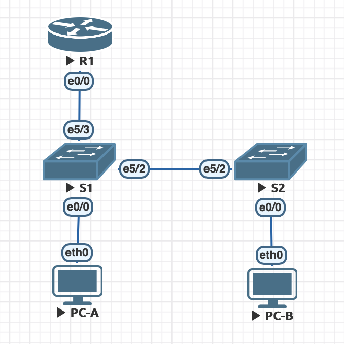

# VLAN и маршрутизация между VLAN



## Addressing Table

|Device     |Interface     |IP Address    |Subnet Mas     |Default Gateway |
|:----------|:-------------|:-------------|:--------------|:---------------|
|R1         |e0/0.3        |192.168.3.1   |255.255.255.0  |N/A             |
|           |e0/0.4        |192.168.4.1   |255.255.255.0  |N/A             |
|           |e0/0.8        |N/A           |N/A            |N/A             |
|S1         |VLAN 3        |192.168.3.11  |255.255.255.0  |192.168.3.1     |
|S2         |VLAN 3        |192.168.3.12  |255.255.255.0  |192.168.3.1     |
|PC-A       |eth0          |192.168.3.3   |255.255.255.0  |192.168.3.1     |
|PC-B       |eth0          |192.168.4.3   |255.255.255.0  |192.168.4.1     |

## VLAN Table

|VLAN       |Name          |Interface Assigned |
|:----------|:-------------|:------------------|
|3          |Management    |S1: VLAN 3         |
|           |              |S2: VLAN 3         |
|           |              |S1: e0/0           |
|4          |Operations    |S2: e0/0           |
|7          |ParkingLot    |S1: e0/1-e0/3, e1/0-e1/3, e2/0-e2/3, e3/0-e3/3, e4/0-e4/3, e5/0-e5/1|
|           |              |S2: e0/1-e0/3, e1/0-e1/3, e2/0-e2/3, e3/0-e3/3, e4/0-e4/3, e5/0-e5/1, e5/3|
|8          |Native        |N/A   |

# Part 1: Build the Network and Configure Basic Device Settings

На примере маршрутизатора R1:

### 1. Войти в режим конфигурации
```bash
Router> enable
Router# configure terminal
```

### 2. Назначить имя устройству
```bash
Router(config)# hostname R1
R1(config)#
```

### 3. Отключить DNS lookup
```bash
R1(config)# no ip domain-lookup
```

### 4. Назначить зашифрованный пароль для привилегированного режима (privileged EXEC)
```bash
R1(config)# enable secret otus
```

### 5. Настроить пароль для консоли и включить аутентификацию
```bash
R1(config)# line console 0
R1(config-line)# password otus
R1(config-line)# login
R1(config-line)# exit
```

### 6. Настроить пароль для VTY (удаленный доступ) и включить аутентификацию
```bash
R1(config)# line vty 0 4
R1(config-line)# password otus
R1(config-line)# login
R1(config-line)# exit
```

### 7. Включить шифрование паролей в конфигурации
```bash
R1(config)# service password-encryption
```

### 8. Создать баннер
```bash
R1(config)# banner motd #Unauthorized access is prohibited.#
```

### 9. Сохранить конфигурацию
```bash
R1(config)# exit
R1# copy running-config startup-config
```

### 10. Установка времени на маршрутизаторе
```bash
R1# clock set 14:30:00 10 Oct 2023
```

### 11. Проверка конфигурации
Для проверки текущей конфигурации выполнить команду:

```bash
R1# show running-config
```

На примере PC-A:

```bash
set pcname PC-A
ip 192.168.3.3/24 192.168.3.1
save
```

# Part 2: Create VLANs and Assign Switch Ports

### 1. Создать и настроить VLAN на каждом коммутаторе

#### Настроить S1:

   ```bash
   S1> enable
   S1# configure terminal
   S1(config)# vlan 3
   S1(config-vlan)# name Management
   S1(config-vlan)# exit
   S2(config)# vlan 4
   S2(config-vlan)# name Operations
   S2(config-vlan)# exit
   S1(config)# vlan 7
   S1(config-vlan)# name ParkingLot
   S1(config-vlan)# exit
   S1(config)# vlan 8
   S1(config-vlan)# name Native
   S1(config-vlan)# exit
   ```

#### Настроить S2:

   ```bash
   S2> enable
   S2# configure terminal
   S2(config)# vlan 3
   S2(config-vlan)# name Management
   S2(config-vlan)# exit
   S2(config)# vlan 4
   S2(config-vlan)# name Operations
   S2(config-vlan)# exit
   S2(config)# vlan 7
   S2(config-vlan)# name ParkingLot
   S2(config-vlan)# exit
   S2(config)# vlan 8
   S2(config-vlan)# name Native
   S2(config-vlan)# exit
   ```

#### Проверить созданные VLAN:

   ```bash
   Switch# show vlan brief
   ```

### 2. Настроить управляющий интерфейс и шлюз по-умолчанию

#### Настроить S1:

   ```bash
   S1(config)# interface vlan 3
   S1(config-if)# ip address 192.168.3.11 255.255.255.0
   S1(config-if)# no shutdown
   S1(config-if)# exit
   S1(config)# ip default-gateway 192.168.3.1
   ```

#### Настроить S2:

   ```bash
   S2(config)# interface vlan 3
   S2(config-if)# ip address 192.168.3.12 255.255.255.0
   S2(config-if)# no shutdown
   S2(config-if)# exit
   S2(config)# ip default-gateway 192.168.3.1
   ```

#### Проверить настройки:

   ```bash
   Switch# show ip interface brief
   ```

### 3. Настройка  портов

#### Настроить S1:

   ```bash
   S1(config)# interface Ethernet0/0
   S1(config-if)# switchport mode access
   S1(config-if)# switchport access vlan 3
   S1(config-if)# exit
   S1(config)# interface range Ethernet 0/1-3
   S1(config-if)# switchport access vlan 7
   S1(config-if-range)# shutdown
   S1(config)# interface range Ethernet 1/0-3
   S1(config-if)# switchport access vlan 7
   S1(config-if-range)# shutdown
   S1(config)# interface range Ethernet 2/0-3
   S1(config-if)# switchport access vlan 7
   S1(config-if-range)# shutdown
   S1(config)# interface range Ethernet 3/0-3
   S1(config-if)# switchport access vlan 7
   S1(config-if-range)# shutdown
   S1(config)# interface range Ethernet 4/0-3
   S1(config-if)# switchport access vlan 7
   S1(config-if-range)# shutdown
   S1(config)# interface range Ethernet 5/0-1
   S1(config-if)# switchport access vlan 7
   S1(config-if-range)# shutdown
   S1(config-if-range)# exit
   S1(config)# exit
   ```

#### Настроить S2:

   ```bash
   S2(config)# interface Ethernet0/0
   S2(config-if)# switchport mode access
   S2(config-if)# switchport access vlan 4
   S2(config)# interface range Ethernet 0/1-3
   S1(config-if)# switchport access vlan 7
   S2(config-if-range)# shutdown
   S2(config)# interface range Ethernet 1/0-3
   S1(config-if)# switchport access vlan 7
   S2(config-if-range)# shutdown
   S2(config)# interface range Ethernet 2/0-3
   S1(config-if)# switchport access vlan 7
   S2(config-if-range)# shutdown
   S2(config)# interface range Ethernet 3/0-3
   S1(config-if)# switchport access vlan 7
   S2(config-if-range)# shutdown
   S2(config)# interface range Ethernet 4/0-3
   S1(config-if)# switchport access vlan 7
   S2(config-if-range)# shutdown
   S2(config)# interface range Ethernet 5/0-1
   S1(config-if)# switchport access vlan 7
   S2(config-if-range)# shutdown
   S2(config)# interface Ethernet5/3
   S1(config-if)# switchport access vlan 7
   S2(config-if-range)# shutdown
   S2(config-if-range)# exit
   S2(config)# exit
   ```

#### Проверить настройки портов:

   ```bash
   Switch# show vlan brief
   Switch# show ip interface brief
   Switch# show interface status
   ```

# Part 3: Configure an 802.1Q Trunk between the Switches

#### Настроить S1:

   ```bash
   S1(config)# interface Ethernet5/2
   S1(config-if)# switchport trunk encapsulation dot1q
   S1(config-if)# switchport mode trunk
   S1(config-if)# switchport trunk native vlan 8
   S1(config-if)# switchport trunk allowed vlan 3-4,7-8
   S1(config-if)# no shutdown
   S1(config-if)# interface Ethernet5/3
   S1(config-if)# switchport trunk encapsulation dot1q
   S1(config-if)# switchport mode trunk
   S1(config-if)# switchport trunk native vlan 8
   S1(config-if)# switchport trunk allowed vlan 3-4,7-8
   S1(config-if)# no shutdown
   S1(config-if)# exit
   ```

#### Настроить S2:

   ```bash
   S2(config)# interface Ethernet5/2
   S2(config-if)# switchport trunk encapsulation dot1q
   S2(config-if)# switchport mode trunk
   S2(config-if)# switchport trunk native vlan 8
   S2(config-if)# switchport trunk allowed vlan 3-4,7-8
   S2(config-if)# no shutdown
   S2(config-if)# exit
   ```

#### Проверить настройки:

   ```bash
   Switch# show interfaces trunk
   ```

# Part 4: Configure Inter-VLAN Routing on the Router

#### Настроить R1:

   ```bash
   R1> enable
   R1# configure terminal
   R1(config)# interface Ethernet 0/0
   R1(config-if)# no shutdown
   R1(config-if)# exit
   R1(config)# interface Ethernet 0/0/1.3
   R1(config-subif)# description VLAN 3
   R1(config-subif)# encapsulation dot1Q 3
   R1(config-subif)# ip address 192.168.3.1 255.255.255.0
   R1(config)# interface Ethernet 0/0/1.4
   R1(config-subif)# description VLAN 4
   R1(config-subif)# encapsulation dot1Q 4
   R1(config-subif)# ip address 192.168.4.1 255.255.255.0
   R1(config)# interface Ethernet 0/0/1.8
   R1(config-subif)# description native VLAN 8
   R1(config-subif)# encapsulation dot1Q 8 native
   R1(config-subif)# exit
```

#### Проверить настройки:

   ```bash
   R1# show ip interface brief
   ```


# Part 5: Verify Inter-VLAN Routing is working

#### 1. Ping from PC-A to its default gateway

   ```bash
   PC-A> ping 192.168.3.1

   84 bytes from 192.168.3.1 icmp_seq=1 ttl=255 time=0.501 ms
   84 bytes from 192.168.3.1 icmp_seq=2 ttl=255 time=0.760 ms
   84 bytes from 192.168.3.1 icmp_seq=3 ttl=255 time=0.906 ms
   84 bytes from 192.168.3.1 icmp_seq=4 ttl=255 time=0.703 ms
   84 bytes from 192.168.3.1 icmp_seq=5 ttl=255 time=0.953 ms
   ```

#### 2. Ping from PC-A to PC-B

   ```bash
   PC-A> ping 192.168.4.3

   84 bytes from 192.168.4.3 icmp_seq=1 ttl=63 time=2.264 ms
   84 bytes from 192.168.4.3 icmp_seq=2 ttl=63 time=1.603 ms
   84 bytes from 192.168.4.3 icmp_seq=3 ttl=63 time=1.389 ms
   84 bytes from 192.168.4.3 icmp_seq=4 ttl=63 time=1.468 ms
   84 bytes from 192.168.4.3 icmp_seq=5 ttl=63 time=1.653 ms
   ```

#### 3. Ping from PC-A to S2

   ```bash
   PC-A> ping 192.168.3.12

   84 bytes from 192.168.3.12 icmp_seq=1 ttl=255 time=0.473 ms
   84 bytes from 192.168.3.12 icmp_seq=2 ttl=255 time=0.816 ms
   84 bytes from 192.168.3.12 icmp_seq=3 ttl=255 time=0.990 ms
   84 bytes from 192.168.3.12 icmp_seq=4 ttl=255 time=0.747 ms
   84 bytes from 192.168.3.12 icmp_seq=5 ttl=255 time=0.725 ms
   ```

#### 4. From the command prompt on PC-B, issue the tracert command to the address of PC-A

   ```bash
   PC-B> trace 192.168.3.3 -P 1
   trace to 192.168.3.3, 8 hops max (ICMP), press Ctrl+C to stop
    1   192.168.4.1   0.798 ms  0.594 ms  0.585 ms
    2   192.168.3.3   2.065 ms  1.419 ms  0.919 ms
   ```
