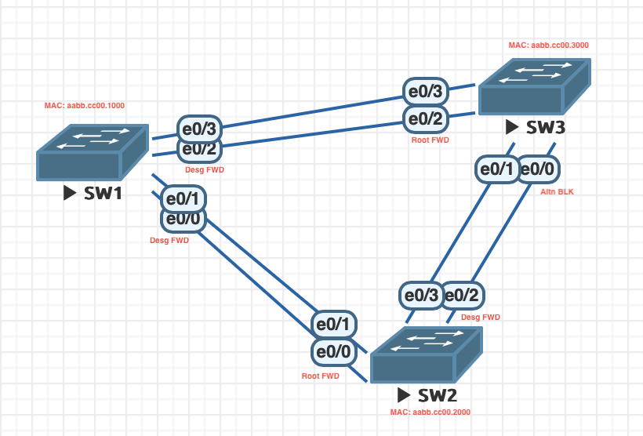

# Избыточность локальных сетей. STP


## Таблица адресации

|Устройство	|Интерфейс	   | IP-адрес	   |Маска подсети  |
|:----------|:-------------|:-------------|:--------------|
|S1	      |VLAN 1	      |192.168.1.1	|255.255.255.0  |
|S2	      |VLAN 1	      |192.168.1.2	|255.255.255.0  |
|S3	      |VLAN 1	      |192.168.1.3	|255.255.255.0  |

## Часть 1: Создание сети и настройка основных параметров устройства

Пример настройки SW1:

```bash
Switch> enable
Switch# configure terminal
Switch(config)# no ip domain-lookup
Switch(config)# hostname SW1
SW1(config)# enable secret otus
SW1(config)# line vty 0 4
SW1(config-line)# password otus
SW1(config-line)# login
SW1(config-line)# exit
SW1(config)# line console 0
SW1(config-line)# logging synchronous
SW1(config-line)# exit
SW1(config)# banner motd #Unauthorized access is prohibited.#
SW1(config)# interface vlan 1
SW1(config-if)# ip address 192.168.1.1 255.255.255.0
SW1(config-if)# no shutdown
SW1(config-if)# exit
SW1(config)# exit
SW1# copy running-config startup-config
```

В: Успешно ли выполняется эхо-запрос от коммутатора S1 на коммутатор S2? 
О: Да:

```bash
SW1>ping 192.168.1.2
Type escape sequence to abort.
Sending 5, 100-byte ICMP Echos to 192.168.1.2, timeout is 2 seconds:
!!!!!
Success rate is 100 percent (5/5), round-trip min/avg/max = 1/1/1 ms
```

В: Успешно ли выполняется эхо-запрос от коммутатора S1 на коммутатор S3?
О: Да:

```bash
SW1>ping 192.168.1.3
Type escape sequence to abort.
Sending 5, 100-byte ICMP Echos to 192.168.1.3, timeout is 2 seconds:
!!!!!
Success rate is 100 percent (5/5), round-trip min/avg/max = 1/1/1 ms
```

В: Успешно ли выполняется эхо-запрос от коммутатора S2 на коммутатор S3?
О: Да:

```bash
SW2>ping 192.168.1.3
Type escape sequence to abort.
Sending 5, 100-byte ICMP Echos to 192.168.1.3, timeout is 2 seconds:
!!!!!
Success rate is 100 percent (5/5), round-trip min/avg/max = 1/1/1 ms
```

## Часть 2:	Определение корневого моста

Пример настройки SW1:

```bash
SW1> en
SW1# conf t
SW1(config)# interface range Ethernet 0/0-3
SW1(config-if-range)# shut
SW2(config-if-range)# switchport trunk encapsulation dot1q
SW2(config-if-range)# switchport mode trunk
SW2(config-if-range)# switchport trunk native vlan 1
SW1(config-if-range)# exit
SW1(config)# interface Ethernet 0/0
SW1(config-if)# no shut
SW1(config)# interface Ethernet 0/2
SW1(config-if)# no shut
SW1(config-if)# end
```

Вывод spanning-tree:

```bash
SW1#show spanning-tree

VLAN0001
  Spanning tree enabled protocol ieee
  Root ID    Priority    32769
             Address     aabb.cc00.1000
             This bridge is the root
             Hello Time   2 sec  Max Age 20 sec  Forward Delay 15 sec

  Bridge ID  Priority    32769  (priority 32768 sys-id-ext 1)
             Address     aabb.cc00.1000
             Hello Time   2 sec  Max Age 20 sec  Forward Delay 15 sec
             Aging Time  300 sec

Interface           Role Sts Cost      Prio.Nbr Type
------------------- ---- --- --------- -------- --------------------------------
Et0/0               Desg FWD 100       128.1    Shr
Et0/2               Desg FWD 100       128.3    Shr
```

```bash
SW2#show spanning-tree

VLAN0001
  Spanning tree enabled protocol ieee
  Root ID    Priority    32769
             Address     aabb.cc00.1000
             Cost        100
             Port        1 (Ethernet0/0)
             Hello Time   2 sec  Max Age 20 sec  Forward Delay 15 sec

  Bridge ID  Priority    32769  (priority 32768 sys-id-ext 1)
             Address     aabb.cc00.2000
             Hello Time   2 sec  Max Age 20 sec  Forward Delay 15 sec
             Aging Time  300 sec

Interface           Role Sts Cost      Prio.Nbr Type
------------------- ---- --- --------- -------- --------------------------------
Et0/0               Root FWD 100       128.1    Shr
Et0/2               Desg FWD 100       128.3    Shr
```

```bash
SW3#show spanning-tree

VLAN0001
  Spanning tree enabled protocol ieee
  Root ID    Priority    32769
             Address     aabb.cc00.1000
             Cost        100
             Port        3 (Ethernet0/2)
             Hello Time   2 sec  Max Age 20 sec  Forward Delay 15 sec

  Bridge ID  Priority    32769  (priority 32768 sys-id-ext 1)
             Address     aabb.cc00.3000
             Hello Time   2 sec  Max Age 20 sec  Forward Delay 15 sec
             Aging Time  300 sec

Interface           Role Sts Cost      Prio.Nbr Type
------------------- ---- --- --------- -------- --------------------------------
Et0/0               Altn BLK 100       128.1    Shr
Et0/2               Root FWD 100       128.3    Shr
```



В: Какой коммутатор является корневым мостом?
О: SW1

В: Почему этот коммутатор был выбран протоколом spanning-tree в качестве корневого моста?
О: Он имеет минимальный BID

В: Какие порты на коммутаторе являются корневыми портами?
О: SW2: Et0/0, SW3: Et0/2

В: Какие порты на коммутаторе являются назначенными портами?
О: SW1: Et0/0 и Et0/2, SW2: Et0/2, SW3: -

В: Какой порт отображается в качестве альтернативного и в настоящее время заблокирован?
О: SW3: Et0/0

В: Почему протокол spanning-tree выбрал этот порт в качестве невыделенного (заблокированного) порта?
О: Потому что порт коммутатора SW2 с наименшей стоимостью пути к корневому мосту явлется назначенным портом (из-за более низкого значения идентификатора моста-отправителя)


## Часть 3: Наблюдение за процессом выбора протоколом STP порта, исходя из стоимости портов

На коммутаторе SW3 заблокирован порт Et0/0, Et0/2 - корневой.

```bash
SW3> en
SW3# conf t
SW3(config)# interface Ethernet 0/2
SW3(config-if)# spanning-tree cost 19
SW3(config-if)# end
SW3# show spanning-tree

VLAN0001
  Spanning tree enabled protocol ieee
  Root ID    Priority    32769
             Address     aabb.cc00.1000
             Cost        19
             Port        3 (Ethernet0/2)
             Hello Time   2 sec  Max Age 20 sec  Forward Delay 15 sec

  Bridge ID  Priority    32769  (priority 32768 sys-id-ext 1)
             Address     aabb.cc00.3000
             Hello Time   2 sec  Max Age 20 sec  Forward Delay 15 sec
             Aging Time  300 sec

Interface           Role Sts Cost      Prio.Nbr Type
------------------- ---- --- --------- -------- --------------------------------
Et0/0               Desg FWD 100       128.1    Shr
Et0/2               Root FWD 19        128.3    Shr
```

На SW2 порт Et0/2 стал заблокированным:

```bash
SW2#show spanning-tree

VLAN0001
  Spanning tree enabled protocol ieee
  Root ID    Priority    32769
             Address     aabb.cc00.1000
             Cost        100
             Port        1 (Ethernet0/0)
             Hello Time   2 sec  Max Age 20 sec  Forward Delay 15 sec

  Bridge ID  Priority    32769  (priority 32768 sys-id-ext 1)
             Address     aabb.cc00.2000
             Hello Time   2 sec  Max Age 20 sec  Forward Delay 15 sec
             Aging Time  15  sec

Interface           Role Sts Cost      Prio.Nbr Type
------------------- ---- --- --------- -------- --------------------------------
Et0/0               Root FWD 100       128.1    Shr
Et0/2               Altn BLK 100       128.3    Shr
```

В: Почему протокол spanning-tree заменяет ранее заблокированный порт на назначенный порт и блокирует порт, который был назначенным портом на другом коммутаторе?
О: Потому-что стоимость корневого пути через SW3 уменьшалась

На коммутаторе SW3 сборосить стоимость коренвого пути Et0/2:

```bash
SW3> en
SW3# conf t
SW3(config)# interface Ethernet 0/2
SW3(config-if)# no spanning-tree cost 19
SW3(config-if)# end
SW3# show spanning-tree

VLAN0001
  Spanning tree enabled protocol ieee
  Root ID    Priority    32769
             Address     aabb.cc00.1000
             Cost        100
             Port        3 (Ethernet0/2)
             Hello Time   2 sec  Max Age 20 sec  Forward Delay 15 sec

  Bridge ID  Priority    32769  (priority 32768 sys-id-ext 1)
             Address     aabb.cc00.3000
             Hello Time   2 sec  Max Age 20 sec  Forward Delay 15 sec
             Aging Time  15  sec

Interface           Role Sts Cost      Prio.Nbr Type
------------------- ---- --- --------- -------- --------------------------------
Et0/0               Altn BLK 100       128.1    Shr
Et0/2               Root FWD 100       128.3    Shr
```

Порт Et0/0 вернулся в исходное заблокированное состояние.

## Часть 4: Наблюдение за процессом выбора протоколом STP порта, исходя из приоритета портов

Включение портов Et0/1 и Et0/3 на примере SW1:

```bash
SW1> en
SW1# conf t
SW1(config)# interface Ethernet 0/1
SW1(config-if)# no shut
SW1(config)# interface Ethernet 0/3
SW1(config-if)# no shut
SW1(config-if)# end
```

```bash
SW1#show spanning-tree

VLAN0001
  Spanning tree enabled protocol ieee
  Root ID    Priority    32769
             Address     aabb.cc00.1000
             This bridge is the root
             Hello Time   2 sec  Max Age 20 sec  Forward Delay 15 sec

  Bridge ID  Priority    32769  (priority 32768 sys-id-ext 1)
             Address     aabb.cc00.1000
             Hello Time   2 sec  Max Age 20 sec  Forward Delay 15 sec
             Aging Time  300 sec

Interface           Role Sts Cost      Prio.Nbr Type
------------------- ---- --- --------- -------- --------------------------------
Et0/0               Desg FWD 100       128.1    Shr
Et0/1               Desg FWD 100       128.2    Shr
Et0/2               Desg FWD 100       128.3    Shr
Et0/3               Desg FWD 100       128.4    Shr
```

```bash
SW2#show spanning-tree

VLAN0001
  Spanning tree enabled protocol ieee
  Root ID    Priority    32769
             Address     aabb.cc00.1000
             Cost        100
             Port        1 (Ethernet0/0)
             Hello Time   2 sec  Max Age 20 sec  Forward Delay 15 sec

  Bridge ID  Priority    32769  (priority 32768 sys-id-ext 1)
             Address     aabb.cc00.2000
             Hello Time   2 sec  Max Age 20 sec  Forward Delay 15 sec
             Aging Time  300 sec

Interface           Role Sts Cost      Prio.Nbr Type
------------------- ---- --- --------- -------- --------------------------------
Et0/0               Root FWD 100       128.1    Shr
Et0/1               Altn BLK 100       128.2    Shr
Et0/2               Desg FWD 100       128.3    Shr
Et0/3               Desg FWD 100       128.4    Shr
```

```bash
SW3#show spanning-tree

VLAN0001
  Spanning tree enabled protocol ieee
  Root ID    Priority    32769
             Address     aabb.cc00.1000
             Cost        100
             Port        3 (Ethernet0/2)
             Hello Time   2 sec  Max Age 20 sec  Forward Delay 15 sec

  Bridge ID  Priority    32769  (priority 32768 sys-id-ext 1)
             Address     aabb.cc00.3000
             Hello Time   2 sec  Max Age 20 sec  Forward Delay 15 sec
             Aging Time  300 sec

Interface           Role Sts Cost      Prio.Nbr Type
------------------- ---- --- --------- -------- --------------------------------
Et0/0               Altn BLK 100       128.1    Shr
Et0/1               Altn BLK 100       128.2    Shr
Et0/2               Root FWD 100       128.3    Shr
Et0/3               Altn BLK 100       128.4    Shr
```

В: Какой порт выбран протоколом STP в качестве порта корневого моста на каждом коммутаторе некорневого моста?
О: SW2: Et0/0, SW3: Et0/2

В: Почему протокол STP выбрал эти порты в качестве портов корневого моста на этих коммутаторах?
О: Имеет наименьший приоритет порта и ближайший к корневому мосту с точки
зрения общей стоимости маршрута к нему

## Вопросы для повторения

1.	Какое значение протокол STP использует первым после выбора корневого моста, чтобы определить выбор порта?
О: Root Path Cost (RPC) - расстояние до корневого коммутатора

2.	Если первое значение на двух портах одинаково, какое следующее значение будет использовать протокол STP при выборе порта?
О: Если Root Path Cost на двух портах одинаков, следующим критерием выбора становится Bridge Identifier (BID) соседнего коммутатора

3.	Если оба значения на двух портах равны, каким будет следующее значение, которое использует протокол STP при выборе порта?
О: Если и BID соседних коммутаторов одинаков, то используется следующий критерий - lowest local port ID
