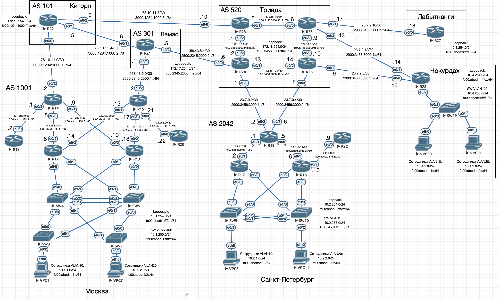

# Архитектура сети

Считаем что:
1) Киторн, Ламас, Триада - провайдеры
2) Москва, Санкт-Петербург, Чокурдах, Лабытнанги - офисы

Провайдеры предоставляют офисам внешние IP-адреса.
В каждом офисе своя адресация сетей.

## Адресное пространство

### Офисы:
1. Москва  
   - Внутренняя сеть: `10.1.0.0/16`, `fc00:abcd:1::/48`
     - Сотрудники VLAN10: `10.1.1.0/24`, `fc00:abcd:1:1::/64`
     - Сотрудники VLAN20: `10.1.2.0/24`, `fc00:abcd:1:2::/64`
     - Сети для маршрутизаторов: `10.1.253.0/24`, `fc00:abcd:1:fffd::/64` (разделены на /30 - IPv4 и /80 - IPv6)
     - Интерфейсы loopback: `10.1.254.0/24`, `fc00:abcd:1:fffe::/64`
     - Интерфейсы управления SW VLAN100: `10.1.255.0/24`, `fc00:abcd:1:ffff::/64`

2. Санкт-Петербург
   - Внутренняя сеть: `10.2.0.0/16`, `fc00:abcd:2::/48`
     - Сотрудники VLAN10: `10.2.1.0/24`, `fc00:abcd:2:1::/64`
     - Сотрудники VLAN20: `10.2.2.0/24`, `fc00:abcd:2:2::/64`
     - Сети для маршрутизаторов: `10.2.253.0/24`, `fc00:abcd:2:fffd::/64` (разделены на /30 - IPv4 и /80 - IPv6)
     - Интерфейсы loopback: `10.2.254.0/24`, `fc00:abcd:2:fffe::/64`
     - Интерфейсы управления SW VLAN100: `10.2.255.0/24`, `fc00:abcd:2:ffff::/64`

3. Лабытнанги
   - Внутренняя сеть: `10.3.0.0/16`, `fc00:abcd:3::/48`
     - Интерфейсы loopback: `10.3.254.0/24`, `fc00:abcd:3:fffe::/64`

4. Чокурдах
   - Внутренняя сеть: `10.4.0.0/16`, `fc00:abcd:4::/48`
     - Сотрудники VLAN10: `10.4.1.0/24`, `fc00:abcd:4:1::/64`
     - Сотрудники VLAN20: `10.4.2.0/24`, `fc00:abcd:4:2::/64`
     - Интерфейсы loopback: `10.4.254.0/24`, `fc00:abcd:4:fffe::/64`
     - Интерфейсы управления SW VLAN100: `10.4.255.0/24`, `fc00:abcd:4:ffff::/64`

### Провайдеры:
- **Киторн**:  
  - Внешняя сеть: `78.10.11.0/24`, `3000:1234:1000::/48`
    - Линк к Москве: `78.10.11.0/30`, `3000:1234:1000:1::/64`
    - Линк к Ламас: `78.10.11.4/30`, `3000:1234:1000:2::/64`
    - Линк к Триада: `78.10.11.8/30`, `3000:1234:1000:3::/64`
  - Внутренняя сеть: `172.16.0.0/16`, `fc00:1234:1000::/48`
     - Интерфейсы loopback: `172.16.254.0/24`, `fc00:1234:1000:fffe::/64`

- **Ламас**:
  - Внешняя сеть: `158.43.5.0/24`, `2500:2345:2000::/48`
    - Линк к Москве: `158.43.5.0/30`, `2500:2345:2000:1::/64`
    - Линк к Триаде: `158.43.5.4/30`, `2500:2345:2000:2::/64`
  - Внутренняя сеть: `172.17.0.0/16`, `fc00:2345:2000::/48`
     - Интерфейсы loopback: `172.17.254.0/24`, `fc00:2345:2000:fffe::/64`

- **Триада**:  
   - Внешняя сеть: `23.7.9.0/24`, `2900:3456:3000::/48`
     - Первый линк к Санкт-Петербургу: `23.7.9.0/30`, `2900:3456:3000:1::/64`
     - Второй линк к Санкт-Петербургу: `23.7.9.4/30`, `2900:3456:3000:2::/64`
     - Первый линк к Чокурдах: `23.7.9.8/30`, `2900:3456:3000:3::/64`
     - Второй линк к Чокурдах: `23.7.9.12/30`, `2900:3456:3000:4::/64`
     - Линк к Лабытнанги: `23.7.9.16/30`, `2900:3456:3000:5::/64`
  - Внутренняя сеть: `172.18.0.0/16`, `fc00:3456:3000::/48`
     - Сети для маршрутизаторов: `172.18.0.0/24`, `fc00:3456:3000:fffd::/64` (разделены на /30 - IPv4 и /80 - IPv6)
     - Интерфейсы loopback: `172.18.254.0/24`, `fc00:3456:3000:fffe::/64`

---

### Примечания:
   - Последний октет в IP-адресе для loopback маршрутизаторов и коммутаторов совпадает с его ID.
   - Для линков использованы подсети `/30` (4 адреса), подходящие для point-to-point соединений.
   - Каждый объект (офис/провайдер) получил уникальный `/48` для гибкости.
   - Линки и внутренние сети выделены как `/64` (стандарт для IPv6).

Схема обеспечивает масштабируемость и четкое разделение адресных пространств.
IP-адреса указаны на схеме и в конфигурационных [файлах](./conf).
