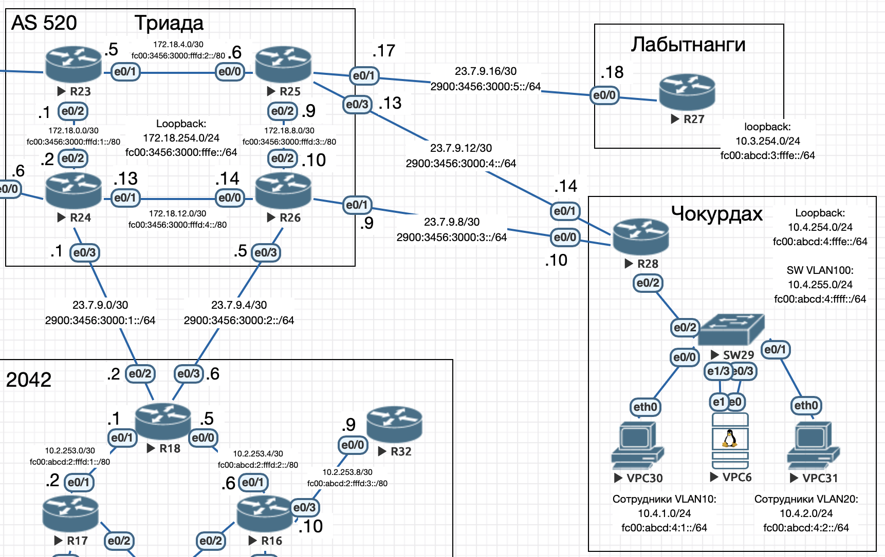

# Маршрутизация на основе политик (PBR)

## Цель:
Настроить политику маршрутизации в офисе Чокурдах. Распределить трафик между 2 линками.

1. Настроите политику маршрутизации для сетей офиса.
2. Распределите трафик между двумя линками с провайдером.
3. Настроите отслеживание линка через технологию IP SLA.(только для IPv4)
4. Настройте для офиса Лабытнанги маршрут по-умолчанию.



## Политика маршрутизации

- Сотрудники VLAN10 выходят в интернет через маршрутизатор провайдера ```23.7.9.9, 2900:3456:3000:3::9```.
- Сотрудники VLAN20 выходят в интернет через маршрутизатор провайдера ```23.7.9.13, 2900:3456:3000:4::13```.

Для начала настроим статическую маршрутизацию (резерв) на R28:

```bash
ip route 0.0.0.0 0.0.0.0 23.7.9.9
ipv6 route ::/0 2900:3456:3000:3::9
ip route 0.0.0.0 0.0.0.0 23.7.9.13 10
ipv6 route ::/0 2900:3456:3000:4::13 10
```

Временно для проверок на R26 настроим обратные маршруты:

```bash
ip route 10.4.1.0 255.255.255.0 Ethernet0/1
ip route 10.4.2.0 255.255.255.0 Ethernet0/1
ip route 10.4.255.0 255.255.255.0 Ethernet0/1
ipv6 route FC00:ABCD:4:1::/64 2900:3456:3000:3::10
ipv6 route FC00:ABCD:4:2::/64 2900:3456:3000:3::10
ipv6 route FC00:ABCD:4:FFFF::/64 2900:3456:3000:3::10
```

Временно для проверок на R25 настроим обратные маршруты:

```bash
ip route 10.4.1.0 255.255.255.0 Ethernet0/3
ip route 10.4.2.0 255.255.255.0 Ethernet0/3
ip route 10.4.255.0 255.255.255.0 Ethernet0/3
ipv6 route FC00:ABCD:4:1::/64 2900:3456:3000:4::14
ipv6 route FC00:ABCD:4:2::/64 2900:3456:3000:4::14
ipv6 route FC00:ABCD:4:FFFF::/64 2900:3456:3000:4::14
```

Настроим политику маршрутизации:

```bash
access-list 10 permit 10.4.1.0 0.0.0.255
access-list 20 permit 10.4.2.0 0.0.0.255
ipv6 access-list EMPLOYEE_VLAN10
 sequence 20 permit ipv6 FC00:ABCD:4:1::/64 any
ipv6 access-list EMPLOYEE_VLAN20
 sequence 20 permit ipv6 FC00:ABCD:4:2::/64 any
route-map POLICY_ROUTING permit 10
 match ip address 10
 match ipv6 address EMPLOYEE_VLAN10
 set ip next-hop 23.7.9.9
 set ipv6 next-hop 2900:3456:3000:3::9
route-map POLICY_ROUTING permit 20
 match ip address 20
 match ipv6 address EMPLOYEE_VLAN20
 set ip next-hop 23.7.9.13
 set ipv6 next-hop 2900:3456:3000:4::13
interface Ethernet0/2.10
 ip policy route-map POLICY_ROUTING
 ipv6 policy route-map POLICY_ROUTING
interface Ethernet0/2.20
 ip policy route-map POLICY_ROUTING
 ipv6 policy route-map POLICY_ROUTING
```

Проверка на VPC6:

```bash
root@vpc6:~# ip -6 a
1: lo: <LOOPBACK,UP,LOWER_UP> mtu 65536 state UNKNOWN qlen 1000
    inet6 ::1/128 scope host noprefixroute
       valid_lft forever preferred_lft forever
2: ens3: <BROADCAST,MULTICAST,UP,LOWER_UP> mtu 1500 state UP qlen 1000
    inet6 fc00:abcd:4:1:b43e:c047:f8ed:dfd4/128 scope global dynamic noprefixroute
       valid_lft 172257sec preferred_lft 85857sec
    inet6 fc00:abcd:4:1:26f5:ac78:b61b:9cd3/64 scope global dynamic noprefixroute
       valid_lft 2591829sec preferred_lft 604629sec
    inet6 fe80::4951:d5a1:37ee:cfdd/64 scope link noprefixroute
       valid_lft forever preferred_lft forever
3: ens4: <BROADCAST,MULTICAST,UP,LOWER_UP> mtu 1500 state UP qlen 1000
    inet6 fc00:abcd:4:2:1183:9b5c:ec66:432b/128 scope global dynamic noprefixroute
       valid_lft 172257sec preferred_lft 85857sec
    inet6 fc00:abcd:4:2:a33:743f:7794:2606/64 scope global dynamic noprefixroute
       valid_lft 2591980sec preferred_lft 604780sec
    inet6 fe80::b926:d8f0:f728:656c/64 scope link noprefixroute
       valid_lft forever preferred_lft forever

root@vpc6:~# traceroute6 -s fc00:abcd:4:1:b43e:c047:f8ed:dfd4 2000::1
traceroute to 2000::1 (2000::1), 30 hops max, 80 byte packets
 1  fc00:abcd:4:2::1 (fc00:abcd:4:2::1)  1.111 ms  1.007 ms  0.965 ms
 2  2900:3456:3000:3::9 (2900:3456:3000:3::9)  1.138 ms !N  1.067 ms !N  1.007 ms !N
root@vpc6:~# traceroute6 -s fc00:abcd:4:2:1183:9b5c:ec66:432b 2000::1
traceroute to 2000::1 (2000::1), 30 hops max, 80 byte packets
 1  fc00:abcd:4:2::1 (fc00:abcd:4:2::1)  2.476 ms  2.344 ms  2.224 ms
 2  2900:3456:3000:4::13 (2900:3456:3000:4::13)  2.111 ms !N  2.055 ms !N  1.952 ms !
```

## IP SLA

Настроим IP SLA и модифицируем route-map:

```bash
ip sla 1
 icmp-echo 23.7.9.9
 frequency 10
ip sla schedule 1 life forever start-time now
ip sla 2
 icmp-echo 23.7.9.13
 frequency 15
ip sla schedule 2 life forever start-time now
track 10 ip sla 1 reachability
 delay down 5 up 5
track 20 ip sla 2 reachability
 delay down 5 up 5
route-map POLICY_ROUTING permit 10
 match ip address 10
 match ipv6 address EMPLOYEE_VLAN10
 set ip next-hop verify-availability 23.7.9.9 1 track 10
 set ip next-hop 23.7.9.13
 set ipv6 next-hop 2900:3456:3000:3::9
route-map POLICY_ROUTING permit 20
 match ip address 20
 match ipv6 address EMPLOYEE_VLAN20
 set ip next-hop verify-availability 23.7.9.13 1 track 20
 set ip next-hop 23.7.9.9
 set ipv6 next-hop 2900:3456:3000:4::13
```

Проверка:
1. Выключим R26

```bash
root@vpc6:~# ip -4 a
1: lo: <LOOPBACK,UP,LOWER_UP> mtu 65536 qdisc noqueue state UNKNOWN group default qlen 1000
    inet 127.0.0.1/8 scope host lo
       valid_lft forever preferred_lft forever
2: ens3: <BROADCAST,MULTICAST,UP,LOWER_UP> mtu 1500 qdisc fq_codel state UP group default qlen 1000
    altname enp0s3
    inet 10.4.1.3/24 brd 10.4.1.255 scope global dynamic noprefixroute ens3
       valid_lft 84258sec preferred_lft 84258sec
3: ens4: <BROADCAST,MULTICAST,UP,LOWER_UP> mtu 1500 qdisc fq_codel state UP group default qlen 1000
    altname enp0s4
    inet 10.4.2.5/24 brd 10.4.2.255 scope global dynamic noprefixroute ens4
       valid_lft 84263sec preferred_lft 84263sec

root@vpc6:~# ping -I 10.4.1.3 1.1.1.1
PING 1.1.1.1 (1.1.1.1) from 10.4.1.3 : 56(84) bytes of data.
From 23.7.9.13 icmp_seq=2 Destination Host Unreachable
From 23.7.9.13 icmp_seq=3 Destination Host Unreachable
From 23.7.9.13 icmp_seq=4 Destination Host Unreachable
From 23.7.9.13 icmp_seq=5 Destination Host Unreachable
^C
--- 1.1.1.1 ping statistics ---
5 packets transmitted, 0 received, +4 errors, 100% packet loss, time 4020ms

root@vpc6:~# ping -I 10.4.2.5 1.1.1.1
PING 1.1.1.1 (1.1.1.1) from 10.4.2.5 : 56(84) bytes of data.
From 23.7.9.13 icmp_seq=1 Destination Host Unreachable
From 23.7.9.13 icmp_seq=2 Destination Host Unreachable
From 23.7.9.13 icmp_seq=3 Destination Host Unreachable
From 23.7.9.13 icmp_seq=4 Destination Host Unreachable
From 23.7.9.13 icmp_seq=5 Destination Host Unreachable
^C
--- 1.1.1.1 ping statistics ---
5 packets transmitted, 0 received, +5 errors, 100% packet loss, time 4006ms
```

Ответ приходит от R25.

2. Включим R26 и выключим R25

```bash
root@vpc6:~# ping -I 10.4.1.3 1.1.1.1
PING 1.1.1.1 (1.1.1.1) from 10.4.1.3 : 56(84) bytes of data.
From 23.7.9.9 icmp_seq=2 Destination Host Unreachable
From 23.7.9.9 icmp_seq=3 Destination Host Unreachable
From 23.7.9.9 icmp_seq=4 Destination Host Unreachable
^C
--- 1.1.1.1 ping statistics ---
4 packets transmitted, 0 received, +3 errors, 100% packet loss, time 3007ms

root@vpc6:~# ping -I 10.4.2.5 1.1.1.1
PING 1.1.1.1 (1.1.1.1) from 10.4.2.5 : 56(84) bytes of data.
From 23.7.9.9 icmp_seq=2 Destination Host Unreachable
From 23.7.9.9 icmp_seq=3 Destination Host Unreachable
From 23.7.9.9 icmp_seq=4 Destination Host Unreachable
^C
--- 1.1.1.1 ping statistics ---
4 packets transmitted, 0 received, +3 errors, 100% packet loss, time 3008ms
```

Ответ приходит от R26.

## Настройка маршрута по-умолчанию для офиса Лабытнанги 

```bash
ip route 0.0.0.0 0.0.0.0 23.7.9.17
ipv6 route ::/0 2900:3456:3000:5::17
```

Проверка:

```bash
R27#sh ip route
Codes: L - local, C - connected, S - static, R - RIP, M - mobile, B - BGP
       D - EIGRP, EX - EIGRP external, O - OSPF, IA - OSPF inter area
       N1 - OSPF NSSA external type 1, N2 - OSPF NSSA external type 2
       E1 - OSPF external type 1, E2 - OSPF external type 2
       i - IS-IS, su - IS-IS summary, L1 - IS-IS level-1, L2 - IS-IS level-2
       ia - IS-IS inter area, * - candidate default, U - per-user static route
       o - ODR, P - periodic downloaded static route, H - NHRP, l - LISP
       a - application route
       + - replicated route, % - next hop override

Gateway of last resort is 23.7.9.17 to network 0.0.0.0

S*    0.0.0.0/0 [1/0] via 23.7.9.17
      10.0.0.0/32 is subnetted, 1 subnets
C        10.3.254.27 is directly connected, Loopback0
      23.0.0.0/8 is variably subnetted, 2 subnets, 2 masks
C        23.7.9.16/30 is directly connected, Ethernet0/0
L        23.7.9.18/32 is directly connected, Ethernet0/0

R27#sh ipv6 route
IPv6 Routing Table - default - 5 entries
Codes: C - Connected, L - Local, S - Static, U - Per-user Static route
       B - BGP, HA - Home Agent, MR - Mobile Router, R - RIP
       H - NHRP, I1 - ISIS L1, I2 - ISIS L2, IA - ISIS interarea
       IS - ISIS summary, D - EIGRP, EX - EIGRP external, NM - NEMO
       ND - ND Default, NDp - ND Prefix, DCE - Destination, NDr - Redirect
       O - OSPF Intra, OI - OSPF Inter, OE1 - OSPF ext 1, OE2 - OSPF ext 2
       ON1 - OSPF NSSA ext 1, ON2 - OSPF NSSA ext 2, la - LISP alt
       lr - LISP site-registrations, ld - LISP dyn-eid, a - Application
S   ::/0 [1/0]
     via 2900:3456:3000:5::17
C   2900:3456:3000:5::/64 [0/0]
     via Ethernet0/0, directly connected
L   2900:3456:3000:5::18/128 [0/0]
     via Ethernet0/0, receive
LC  FC00:ABCD:3:FFFE::27/128 [0/0]
     via Loopback0, receive
L   FF00::/8 [0/0]
     via Null0, receive
```
