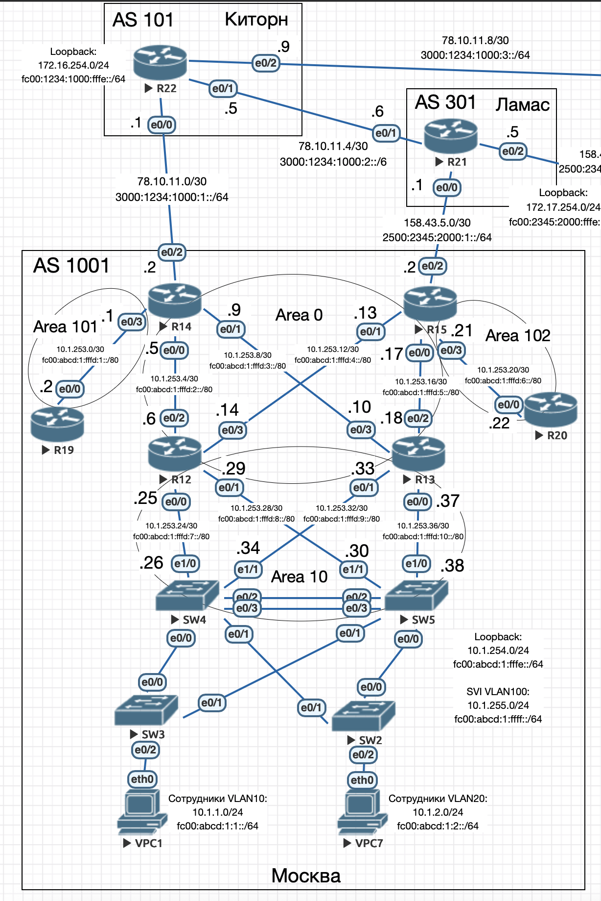
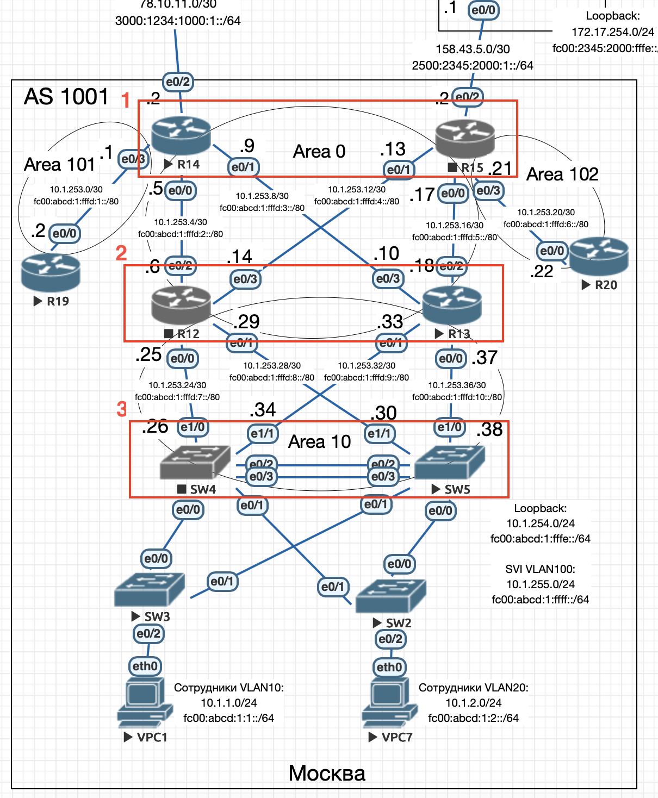

# OSPF. Фильтрация

## Цель

Настроить OSPF офисе Москва. Разделить сеть на зоны. Настроить фильтрацию между зонами

1. Маршрутизаторы R14-R15 находятся в зоне 0 - backbone.
2. Маршрутизаторы R12-R13 находятся в зоне 10. Дополнительно к маршрутам должны получать маршрут по умолчанию.
3. Маршрутизатор R19 находится в зоне 101 и получает только маршрут по умолчанию.
4. Маршрутизатор R20 находится в зоне 102 и получает все маршруты, кроме маршрутов до сетей зоны 101.
5. Настройка для IPv6 повторяет логику IPv4.



## Настройка OSPF

### Особенности

- Поскольку настраивается также IPv6, то использовался только протокол OSPFv3.
- Терминирование шлюзов для сетей в VLAN 10, 20 и 100 выполнены на SW4 и SW5. Для этого созданы SVI. Для отказоустойчивости настроен VRRP. Интерфйесы e1/0 и e1/1 переведены в режим ```no switchport```.
- OSPF также настроен на SW4 и SW5.
- Везде, где настроен OSPF созданы интерфейс Loopback.
- Тип Area 101 - stub, no-summary.
- Тип Area 10 - stub.
- На маршрутизаторах R14-R15 настроено распространение шлюза по-умолчанию ```default-information originate```.
- Между R14 и R19, а также между R15 и R20 настроена сеть OSPF point-to-point.

### Настройка

Пример настройки OSPF на R12:

```bash
router ospfv3 1
 area 10 stub
 address-family ipv4 unicast
 exit-address-family!
 address-family ipv6 unicast
 exit-address-family

interface Loopback0
 ospfv3 1 ipv4 area 0
 ospfv3 1 ipv6 area 0

interface Ethernet0/0
 ospfv3 1 ipv4 area 10
 ospfv3 1 ipv6 area 10

interface Ethernet0/1
 ospfv3 1 ipv4 area 10
 ospfv3 1 ipv6 area 10

interface Ethernet0/2
 ospfv3 1 ipv4 area 0
 ospfv3 1 ipv6 area 0

interface Ethernet0/3
 ospfv3 1 ipv4 area 0
 ospfv3 1 ipv6 area 0
```

Пример настройки OSPF на SW4:

```bash
router ospfv3 1
 area 10 stub
 address-family ipv4 unicast
 exit-address-family
 address-family ipv6 unicast
 exit-address-family

interface Loopback0
 ip address 10.1.254.4 255.255.255.255
 ipv6 address FC00:ABCD:1:FFFE::4/128
 ospfv3 1 ipv4 area 10
 ospfv3 1 ipv6 area 10

interface Ethernet1/0
 no switchport
 ip address 10.1.253.26 255.255.255.252
 duplex auto
 ipv6 address FC00:ABCD:1:FFFD:7::26/80
 ospfv3 1 ipv4 area 10
 ospfv3 1 ipv6 area 10

interface Ethernet1/1
 no switchport
 ip address 10.1.253.34 255.255.255.252
 duplex auto
 ipv6 address FC00:ABCD:1:FFFD:9::34/80
 ospfv3 1 ipv4 area 10
 ospfv3 1 ipv6 area 10

interface Vlan10
 ip address 10.1.1.4 255.255.255.0
 ipv6 address FC00:ABCD:1:1::1/64
 ospfv3 1 ipv4 area 10
 ospfv3 1 ipv6 area 10
 vrrp 2 ip 10.1.1.1
 vrrp 2 priority 110

interface Vlan20
 ip address 10.1.2.4 255.255.255.0
 ipv6 address FC00:ABCD:1:2::1/64
 ospfv3 1 ipv4 area 10
 ospfv3 1 ipv6 area 10
 vrrp 3 ip 10.1.2.1
 vrrp 3 priority 110

interface Vlan100
 ip address 10.1.255.4 255.255.255.0
 ipv6 address FC00:ABCD:1:FFFF::4/64
 ospfv3 1 ipv4 area 10
 ospfv3 1 ipv6 area 10
 vrrp 1 ip 10.1.255.1
 vrrp 1 priority 110
```

Полные настройки устройств приведены в в конфигурационных [файлах](./conf).

Проверка:

```bash
R12>sh ospfv3 1 ipv4 neighbor

          OSPFv3 1 address-family ipv4 (router-id 10.1.254.12)

Neighbor ID     Pri   State           Dead Time   Interface ID    Interface
10.1.254.15       1   FULL/BDR        00:00:36    4               Ethernet0/3
10.1.254.14       1   FULL/DR         00:00:38    3               Ethernet0/2
10.1.254.5        1   FULL/BDR        00:00:35    14              Ethernet0/1
10.1.254.4        1   FULL/BDR        00:00:38    13              Ethernet0/0

R12>sh ospfv3 1 ipv6 neighbor

          OSPFv3 1 address-family ipv6 (router-id 10.1.254.12)

Neighbor ID     Pri   State           Dead Time   Interface ID    Interface
10.1.254.15       1   FULL/DR         00:00:35    4               Ethernet0/3
10.1.254.14       1   FULL/BDR        00:00:34    3               Ethernet0/2
10.1.254.5        1   FULL/BDR        00:00:34    14              Ethernet0/1
10.1.254.4        1   FULL/BDR        00:00:34    13              Ethernet0/0

R12#sh ip route
Codes: L - local, C - connected, S - static, R - RIP, M - mobile, B - BGP
       D - EIGRP, EX - EIGRP external, O - OSPF, IA - OSPF inter area
       N1 - OSPF NSSA external type 1, N2 - OSPF NSSA external type 2
       E1 - OSPF external type 1, E2 - OSPF external type 2
       i - IS-IS, su - IS-IS summary, L1 - IS-IS level-1, L2 - IS-IS level-2
       ia - IS-IS inter area, * - candidate default, U - per-user static route
       o - ODR, P - periodic downloaded static route, H - NHRP, l - LISP
       a - application route
       + - replicated route, % - next hop override

Gateway of last resort is 10.1.253.13 to network 0.0.0.0

O*E2  0.0.0.0/0 [110/1] via 10.1.253.13, 00:19:40, Ethernet0/3
                [110/1] via 10.1.253.5, 00:19:40, Ethernet0/2
      10.0.0.0/8 is variably subnetted, 25 subnets, 3 masks
O        10.1.1.0/24 [110/11] via 10.1.253.30, 00:19:40, Ethernet0/1
                     [110/11] via 10.1.253.26, 00:19:40, Ethernet0/0
O        10.1.2.0/24 [110/11] via 10.1.253.30, 00:19:40, Ethernet0/1
                     [110/11] via 10.1.253.26, 00:19:40, Ethernet0/0
O IA     10.1.253.0/30 [110/20] via 10.1.253.5, 00:19:40, Ethernet0/2
C        10.1.253.4/30 is directly connected, Ethernet0/2
L        10.1.253.6/32 is directly connected, Ethernet0/2
O        10.1.253.8/30 [110/20] via 10.1.253.5, 00:25:43, Ethernet0/2
C        10.1.253.12/30 is directly connected, Ethernet0/3
L        10.1.253.14/32 is directly connected, Ethernet0/3
O        10.1.253.16/30 [110/20] via 10.1.253.13, 00:25:43, Ethernet0/3
O IA     10.1.253.20/30 [110/20] via 10.1.253.13, 00:19:40, Ethernet0/3
C        10.1.253.24/30 is directly connected, Ethernet0/0
L        10.1.253.25/32 is directly connected, Ethernet0/0
C        10.1.253.28/30 is directly connected, Ethernet0/1
L        10.1.253.29/32 is directly connected, Ethernet0/1
O        10.1.253.32/30 [110/20] via 10.1.253.26, 00:19:40, Ethernet0/0
O        10.1.253.36/30 [110/20] via 10.1.253.30, 00:19:40, Ethernet0/1
O        10.1.254.4/32 [110/10] via 10.1.253.26, 00:19:40, Ethernet0/0
O        10.1.254.5/32 [110/10] via 10.1.253.30, 00:19:40, Ethernet0/1
C        10.1.254.12/32 is directly connected, Loopback0
O        10.1.254.13/32 [110/20] via 10.1.253.13, 00:25:43, Ethernet0/3
                        [110/20] via 10.1.253.5, 00:25:43, Ethernet0/2
O        10.1.254.14/32 [110/10] via 10.1.253.5, 00:25:43, Ethernet0/2
O        10.1.254.15/32 [110/10] via 10.1.253.13, 00:25:43, Ethernet0/3
O IA     10.1.254.19/32 [110/20] via 10.1.253.5, 00:19:40, Ethernet0/2
O IA     10.1.254.20/32 [110/20] via 10.1.253.13, 00:03:11, Ethernet0/3
O        10.1.255.0/24 [110/11] via 10.1.253.30, 00:19:40, Ethernet0/1
                       [110/11] via 10.1.253.26, 00:19:40, Ethernet0/0

R12#sh ipv6 route
IPv6 Routing Table - default - 27 entries
Codes: C - Connected, L - Local, S - Static, U - Per-user Static route
       B - BGP, HA - Home Agent, MR - Mobile Router, R - RIP
       H - NHRP, I1 - ISIS L1, I2 - ISIS L2, IA - ISIS interarea
       IS - ISIS summary, D - EIGRP, EX - EIGRP external, NM - NEMO
       ND - ND Default, NDp - ND Prefix, DCE - Destination, NDr - Redirect
       O - OSPF Intra, OI - OSPF Inter, OE1 - OSPF ext 1, OE2 - OSPF ext 2
       ON1 - OSPF NSSA ext 1, ON2 - OSPF NSSA ext 2, la - LISP alt
       lr - LISP site-registrations, ld - LISP dyn-eid, a - Application
OE2 ::/0 [110/1], tag 1
     via FE80::A8BB:CCFF:FE00:E000, Ethernet0/2
     via FE80::A8BB:CCFF:FE00:F010, Ethernet0/3
O   FC00:ABCD:1:1::/64 [110/11]
     via FE80::A8BB:CCFF:FE00:4001, Ethernet0/0
     via FE80::A8BB:CCFF:FE00:5011, Ethernet0/1
O   FC00:ABCD:1:2::/64 [110/11]
     via FE80::A8BB:CCFF:FE00:4001, Ethernet0/0
     via FE80::A8BB:CCFF:FE00:5011, Ethernet0/1
OI  FC00:ABCD:1:FFFD:1::/80 [110/20]
     via FE80::A8BB:CCFF:FE00:E000, Ethernet0/2
C   FC00:ABCD:1:FFFD:2::/80 [0/0]
     via Ethernet0/2, directly connected
L   FC00:ABCD:1:FFFD:2::6/128 [0/0]
     via Ethernet0/2, receive
O   FC00:ABCD:1:FFFD:3::/80 [110/20]
     via FE80::A8BB:CCFF:FE00:E000, Ethernet0/2
C   FC00:ABCD:1:FFFD:4::/80 [0/0]
     via Ethernet0/3, directly connected
L   FC00:ABCD:1:FFFD:4::14/128 [0/0]
     via Ethernet0/3, receive
O   FC00:ABCD:1:FFFD:5::/80 [110/20]
     via FE80::A8BB:CCFF:FE00:F010, Ethernet0/3
OI  FC00:ABCD:1:FFFD:6::/80 [110/20]
     via FE80::A8BB:CCFF:FE00:F010, Ethernet0/3
C   FC00:ABCD:1:FFFD:7::/80 [0/0]
     via Ethernet0/0, directly connected
L   FC00:ABCD:1:FFFD:7::25/128 [0/0]
     via Ethernet0/0, receive
C   FC00:ABCD:1:FFFD:8::/80 [0/0]
     via Ethernet0/1, directly connected
L   FC00:ABCD:1:FFFD:8::29/128 [0/0]
     via Ethernet0/1, receive
O   FC00:ABCD:1:FFFD:9::/80 [110/20]
     via FE80::A8BB:CCFF:FE00:4001, Ethernet0/0
O   FC00:ABCD:1:FFFD:10::/80 [110/20]
     via FE80::A8BB:CCFF:FE00:5011, Ethernet0/1
O   FC00:ABCD:1:FFFE::4/128 [110/10]
     via FE80::A8BB:CCFF:FE00:4001, Ethernet0/0
O   FC00:ABCD:1:FFFE::5/128 [110/10]
     via FE80::A8BB:CCFF:FE00:5011, Ethernet0/1
LC  FC00:ABCD:1:FFFE::12/128 [0/0]
     via Loopback0, receive
O   FC00:ABCD:1:FFFE::13/128 [110/20]
     via FE80::A8BB:CCFF:FE00:E000, Ethernet0/2
     via FE80::A8BB:CCFF:FE00:F010, Ethernet0/3
O   FC00:ABCD:1:FFFE::14/128 [110/10]
     via FE80::A8BB:CCFF:FE00:E000, Ethernet0/2
O   FC00:ABCD:1:FFFE::15/128 [110/10]
     via FE80::A8BB:CCFF:FE00:F010, Ethernet0/3
OI  FC00:ABCD:1:FFFE::19/128 [110/20]
     via FE80::A8BB:CCFF:FE00:E000, Ethernet0/2
OI  FC00:ABCD:1:FFFE::20/128 [110/20]
     via FE80::A8BB:CCFF:FE00:F010, Ethernet0/3
O   FC00:ABCD:1:FFFF::/64 [110/11]
     via FE80::A8BB:CCFF:FE00:4001, Ethernet0/0
     via FE80::A8BB:CCFF:FE00:5011, Ethernet0/1
L   FF00::/8 [0/0]
     via Null0, receive
```

## Настройка фильтрации для R20

Для фильтрации маршрута ```10.1.253.0/30``` и ```FC00:ABCD:1:FFFD:1::/80``` на R20 необходимо добавить следующие строки в конфигурационный файл:

```bash
ip prefix-list FILTER_AREA101 seq 5 deny 10.1.253.0/30
ip prefix-list FILTER_AREA101 seq 10 permit 0.0.0.0/0 le 32
ipv6 prefix-list FILTER_AREA101 seq 5 deny FC00:ABCD:1:FFFD:1::/80
ipv6 prefix-list FILTER_AREA101 seq 10 permit ::/0 le 128

router ospfv3 1
 address-family ipv4 unicast
  distribute-list prefix FILTER_AREA101 in
 exit-address-family
 address-family ipv6 unicast
  distribute-list prefix-list FILTER_AREA101 in
 exit-address-family
```

Проверка:

Маршрутов ```10.1.253.0/30``` и ```FC00:ABCD:1:FFFD:1::/80``` нет:

```bash
R20#sh ip route | inc 10.1.253.0
R20#sh ip route | inc FC00:ABCD:1:FFFD:1::/80
R20#
```

## Общая проверка отказоустойчивости



Для проверки отказоустойчивости сети ВРЕМЕННО настроим:

1. На R14 и R15 статический маршрут по умолчанию:

R14:

```bash
ip route 0.0.0.0 0.0.0.0 78.10.11.1
ipv6 route ::/0 3000:1234:1000:1::1
```

R15:

```bash
ip route 0.0.0.0 0.0.0.0 158.43.5.1
ipv6 route ::/0 2500:2345:2000:1::1
```

2. На R21 и R22 статический маршрут к сетям в Москве:

R21:

```bash
ip route 10.1.1.0 255.255.255.0 158.43.5.2
ip route 10.1.2.0 255.255.255.0 158.43.5.2
ip route 10.1.253.0 255.255.255.0 158.43.5.2
ip route 10.1.254.0 255.255.255.0 158.43.5.2
ip route 10.1.255.0 255.255.255.0 158.43.5.2
ipv6 route FC00:ABCD:1::/48 2500:2345:2000:1::2
```

R22:

```bash
ip route 10.1.1.0 255.255.255.0 78.10.11.2
ip route 10.1.2.0 255.255.255.0 78.10.11.2
ip route 10.1.253.0 255.255.255.0 78.10.11.2
ip route 10.1.254.0 255.255.255.0 78.10.11.2
ip route 10.1.255.0 255.255.255.0 78.10.11.2
ipv6 route FC00:ABCD:1::/48 3000:1234:1000:1::2
```

3. С VPC1 и VPC7 проверим трассировку до внешних шлюзов:

```bash
VPC1> trace 1.1.1.1
trace to 1.1.1.1, 8 hops max, press Ctrl+C to stop
 1   10.1.1.4   0.672 ms  0.544 ms  0.479 ms
 2   10.1.253.25   1.282 ms  1.404 ms  1.197 ms
 3   10.1.253.13   1.153 ms  1.243 ms  1.122 ms
 4   158.43.5.1   1.837 ms  1.620 ms  1.761 ms
 5   *158.43.5.1   1.744 ms (ICMP type:3, code:1, Destination host unreachable)  *

VPC1> trace 2000::1

trace to 2000::1, 64 hops max
 1 fc00:abcd:1:1::1   9.873 ms  0.471 ms  0.417 ms
 2 fc00:abcd:1:fffd:7::25   0.796 ms  1.487 ms  0.674 ms
 3 fc00:abcd:1:fffd:4::13   0.926 ms  1.440 ms  1.297 ms
 4 *2500:2345:2000:1::1   2.062 ms (ICMP type:1, code:0, No route to destination)

VPC7> trace 1.1.1.1
trace to 1.1.1.1, 8 hops max, press Ctrl+C to stop
 1   10.1.2.4   0.495 ms  0.431 ms  0.370 ms
 2   10.1.253.33   0.851 ms  0.791 ms  0.722 ms
 3   10.1.253.17   1.272 ms  1.060 ms  0.834 ms
 4   158.43.5.1   1.330 ms  1.370 ms  1.427 ms
 5   *158.43.5.1   1.432 ms (ICMP type:3, code:1, Destination host unreachable)  *

VPC7> trace 2000::1

trace to 2000::1, 64 hops max
 1 fc00:abcd:1:2::5   0.873 ms  0.754 ms  0.599 ms
 2 fc00:abcd:1:fffd:10::37   0.894 ms  0.762 ms  0.840 ms
 3 fc00:abcd:1:fffd:3::9   1.225 ms  1.165 ms  1.350 ms
 4 *3000:1234:1000:1::1   1.601 ms (ICMP type:1, code:0, No route to destination)
```

4. Выключим R15, R12 и SW4 и снова с VPC1 и VPC7 проверим трассировку до внешних шлюзов:

```bash
VPC1> trace 1.1.1.1
trace to 1.1.1.1, 8 hops max, press Ctrl+C to stop
 1   10.1.1.5   0.479 ms  0.669 ms  0.478 ms
 2   10.1.253.37   0.742 ms  0.609 ms  0.743 ms
 3   10.1.253.9   1.085 ms  0.865 ms  0.891 ms
 4   78.10.11.1   1.228 ms  1.397 ms  1.250 ms
 5   *78.10.11.1   1.183 ms (ICMP type:3, code:1, Destination host unreachable)  *

VPC1> trace 2000::1

trace to 2000::1, 64 hops max
 1 fc00:abcd:1:1::5   0.806 ms  0.651 ms  0.654 ms
 2 fc00:abcd:1:fffd:10::37   1.041 ms  0.946 ms  0.799 ms
 3 fc00:abcd:1:fffd:3::9   1.185 ms  0.951 ms  0.899 ms
 4 *3000:1234:1000:1::1   1.329 ms (ICMP type:1, code:0, No route to destination)

VPC7> trace 1.1.1.1
trace to 1.1.1.1, 8 hops max, press Ctrl+C to stop
 1   10.1.2.5   0.622 ms  0.742 ms  0.662 ms
 2   10.1.253.37   0.970 ms  0.712 ms  0.812 ms
 3   10.1.253.9   1.105 ms  0.943 ms  1.086 ms
 4   78.10.11.1   1.425 ms  1.369 ms  1.346 ms
 5   *78.10.11.1   1.230 ms (ICMP type:3, code:1, Destination host unreachable)  *

VPC7> trace 2000::1

trace to 2000::1, 64 hops max
 1 fc00:abcd:1:2::5   0.755 ms  0.451 ms  0.506 ms
 2 fc00:abcd:1:fffd:10::37   0.929 ms  0.821 ms  0.820 ms
 3 fc00:abcd:1:fffd:3::9   1.085 ms  1.173 ms  0.976 ms
 4 *3000:1234:1000:1::1   1.376 ms (ICMP type:1, code:0, No route to destination)
```

Отказ любого одного оборудования в квадратах 1, 2 и 3 (см. рисунок) благодаря перестройке маршрутов и отработке VRRP не приводит к длительному перерыву доступа в Интернет.
