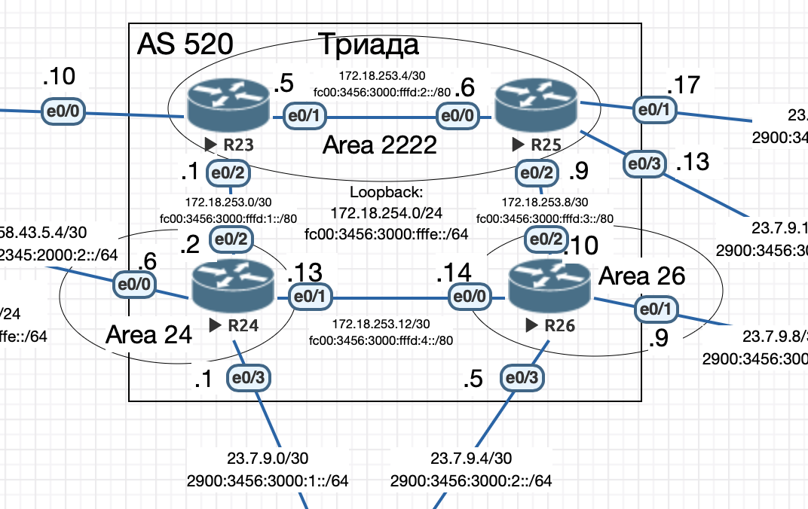

# Протокол IS-IS

## Цель

Настроить IS-IS в офисе Триада.

1. Настроите IS-IS в ISP Триада.
2. R23 и R25 находятся в зоне 2222.
3. R24 находится в зоне 24.
4. R26 находится в зоне 26.



## Настройка IS-IS

### Описание

- Все маршрутизаторы имеют тип L1/L2 (по-умолчанию)
- На маршрутизаторах R23 и R25 явно указаны типы интерфейсов ISIS:

```
hostname R23
interface Ethernet0/1
 ip router isis
 ipv6 router isis
 isis circuit-type level-1
interface Ethernet0/2
 ip router isis
 ipv6 router isis
 isis circuit-type level-2-only
```

```
hostname R25
interface Ethernet0/0
 ip router isis
 ipv6 router isis
 isis circuit-type level-1
interface Ethernet0/2
 ip router isis
 ipv6 router isis
 isis circuit-type level-2-only
```

- Настройка маршрутизаторов осушествляется командой:

```
router isis
 net 49.2222.1720.1825.4025.00
```

где net - NSAP адрес маршрутизатора

Полные настройки устройств приведены в в конфигурационных [файлах](./conf).

Проверка:

```bash
R23# sh ip route isis
Codes: L - local, C - connected, S - static, R - RIP, M - mobile, B - BGP
       D - EIGRP, EX - EIGRP external, O - OSPF, IA - OSPF inter area
       N1 - OSPF NSSA external type 1, N2 - OSPF NSSA external type 2
       E1 - OSPF external type 1, E2 - OSPF external type 2
       i - IS-IS, su - IS-IS summary, L1 - IS-IS level-1, L2 - IS-IS level-2
       ia - IS-IS inter area, * - candidate default, U - per-user static route
       o - ODR, P - periodic downloaded static route, H - NHRP, l - LISP
       a - application route
       + - replicated route, % - next hop override

Gateway of last resort is not set

      172.18.0.0/16 is variably subnetted, 10 subnets, 2 masks
i L2     172.18.253.8/30 [115/30] via 172.18.253.2, 00:19:44, Ethernet0/2
i L2     172.18.253.12/30 [115/20] via 172.18.253.2, 00:19:44, Ethernet0/2
i L2     172.18.254.24/32 [115/20] via 172.18.253.2, 00:19:44, Ethernet0/2
i L1     172.18.254.25/32 [115/20] via 172.18.253.6, 00:22:31, Ethernet0/1
i L2     172.18.254.26/32 [115/30] via 172.18.253.2, 00:19:44, Ethernet0/2

R23# sh ipv6 route isis
IPv6 Routing Table - default - 13 entries
Codes: C - Connected, L - Local, S - Static, U - Per-user Static route
       B - BGP, HA - Home Agent, MR - Mobile Router, R - RIP
       H - NHRP, I1 - ISIS L1, I2 - ISIS L2, IA - ISIS interarea
       IS - ISIS summary, D - EIGRP, EX - EIGRP external, NM - NEMO
       ND - ND Default, NDp - ND Prefix, DCE - Destination, NDr - Redirect
       O - OSPF Intra, OI - OSPF Inter, OE1 - OSPF ext 1, OE2 - OSPF ext 2
       ON1 - OSPF NSSA ext 1, ON2 - OSPF NSSA ext 2, la - LISP alt
       lr - LISP site-registrations, ld - LISP dyn-eid, a - Application
I2  FC00:3456:3000:FFFD:3::/80 [115/30]
     via FE80::A8BB:CCFF:FE01:8020, Ethernet0/2
I2  FC00:3456:3000:FFFD:4::/80 [115/20]
     via FE80::A8BB:CCFF:FE01:8020, Ethernet0/2
I2  FC00:3456:3000:FFFE::24/128 [115/20]
     via FE80::A8BB:CCFF:FE01:8020, Ethernet0/2
I1  FC00:3456:3000:FFFE::25/128 [115/20]
     via FE80::A8BB:CCFF:FE01:9000, Ethernet0/1
I2  FC00:3456:3000:FFFE::26/128 [115/30]
     via FE80::A8BB:CCFF:FE01:8020, Ethernet0/2
```

```
R25#sh ip route isis
Codes: L - local, C - connected, S - static, R - RIP, M - mobile, B - BGP
       D - EIGRP, EX - EIGRP external, O - OSPF, IA - OSPF inter area
       N1 - OSPF NSSA external type 1, N2 - OSPF NSSA external type 2
       E1 - OSPF external type 1, E2 - OSPF external type 2
       i - IS-IS, su - IS-IS summary, L1 - IS-IS level-1, L2 - IS-IS level-2
       ia - IS-IS inter area, * - candidate default, U - per-user static route
       o - ODR, P - periodic downloaded static route, H - NHRP, l - LISP
       a - application route
       + - replicated route, % - next hop override

Gateway of last resort is not set

      172.18.0.0/16 is variably subnetted, 10 subnets, 2 masks
i L2     172.18.253.0/30 [115/30] via 172.18.253.10, 00:12:32, Ethernet0/2
i L2     172.18.253.12/30 [115/20] via 172.18.253.10, 00:24:00, Ethernet0/2
i L1     172.18.254.23/32 [115/20] via 172.18.253.5, 00:23:50, Ethernet0/0
i L2     172.18.254.24/32 [115/30] via 172.18.253.10, 00:21:04, Ethernet0/2
i L2     172.18.254.26/32 [115/20] via 172.18.253.10, 00:24:00, Ethernet0/2
R25#sh ipv6 route isis
IPv6 Routing Table - default - 15 entries
Codes: C - Connected, L - Local, S - Static, U - Per-user Static route
       B - BGP, HA - Home Agent, MR - Mobile Router, R - RIP
       H - NHRP, I1 - ISIS L1, I2 - ISIS L2, IA - ISIS interarea
       IS - ISIS summary, D - EIGRP, EX - EIGRP external, NM - NEMO
       ND - ND Default, NDp - ND Prefix, DCE - Destination, NDr - Redirect
       O - OSPF Intra, OI - OSPF Inter, OE1 - OSPF ext 1, OE2 - OSPF ext 2
       ON1 - OSPF NSSA ext 1, ON2 - OSPF NSSA ext 2, la - LISP alt
       lr - LISP site-registrations, ld - LISP dyn-eid, a - Application
I2  FC00:3456:3000:FFFD:1::/80 [115/30]
     via FE80::A8BB:CCFF:FE01:A020, Ethernet0/2
I2  FC00:3456:3000:FFFD:4::/80 [115/20]
     via FE80::A8BB:CCFF:FE01:A020, Ethernet0/2
I1  FC00:3456:3000:FFFE::23/128 [115/20]
     via FE80::A8BB:CCFF:FE01:7010, Ethernet0/0
I2  FC00:3456:3000:FFFE::24/128 [115/30]
     via FE80::A8BB:CCFF:FE01:A020, Ethernet0/2
I2  FC00:3456:3000:FFFE::26/128 [115/20]
     via FE80::A8BB:CCFF:FE01:A020, Ethernet0/2
```

```
R24#sh ip route isis
Codes: L - local, C - connected, S - static, R - RIP, M - mobile, B - BGP
       D - EIGRP, EX - EIGRP external, O - OSPF, IA - OSPF inter area
       N1 - OSPF NSSA external type 1, N2 - OSPF NSSA external type 2
       E1 - OSPF external type 1, E2 - OSPF external type 2
       i - IS-IS, su - IS-IS summary, L1 - IS-IS level-1, L2 - IS-IS level-2
       ia - IS-IS inter area, * - candidate default, U - per-user static route
       o - ODR, P - periodic downloaded static route, H - NHRP, l - LISP
       a - application route
       + - replicated route, % - next hop override

Gateway of last resort is not set

      172.18.0.0/16 is variably subnetted, 10 subnets, 2 masks
i L2     172.18.253.4/30 [115/20] via 172.18.253.1, 00:21:31, Ethernet0/2
i L2     172.18.253.8/30 [115/20] via 172.18.253.14, 00:21:31, Ethernet0/1
i L2     172.18.254.23/32 [115/20] via 172.18.253.1, 00:21:31, Ethernet0/2
i L2     172.18.254.25/32 [115/30] via 172.18.253.14, 00:21:21, Ethernet0/1
                          [115/30] via 172.18.253.1, 00:21:21, Ethernet0/2
i L2     172.18.254.26/32 [115/20] via 172.18.253.14, 00:21:31, Ethernet0/1
R24#sh ipv6 route isis
IPv6 Routing Table - default - 15 entries
Codes: C - Connected, L - Local, S - Static, U - Per-user Static route
       B - BGP, HA - Home Agent, MR - Mobile Router, R - RIP
       H - NHRP, I1 - ISIS L1, I2 - ISIS L2, IA - ISIS interarea
       IS - ISIS summary, D - EIGRP, EX - EIGRP external, NM - NEMO
       ND - ND Default, NDp - ND Prefix, DCE - Destination, NDr - Redirect
       O - OSPF Intra, OI - OSPF Inter, OE1 - OSPF ext 1, OE2 - OSPF ext 2
       ON1 - OSPF NSSA ext 1, ON2 - OSPF NSSA ext 2, la - LISP alt
       lr - LISP site-registrations, ld - LISP dyn-eid, a - Application
I2  FC00:3456:3000:FFFD:2::/80 [115/20]
     via FE80::A8BB:CCFF:FE01:7020, Ethernet0/2
I2  FC00:3456:3000:FFFD:3::/80 [115/20]
     via FE80::A8BB:CCFF:FE01:A000, Ethernet0/1
I2  FC00:3456:3000:FFFE::23/128 [115/20]
     via FE80::A8BB:CCFF:FE01:7020, Ethernet0/2
I2  FC00:3456:3000:FFFE::25/128 [115/30]
     via FE80::A8BB:CCFF:FE01:7020, Ethernet0/2
     via FE80::A8BB:CCFF:FE01:A000, Ethernet0/1
I2  FC00:3456:3000:FFFE::26/128 [115/20]
     via FE80::A8BB:CCFF:FE01:A000, Ethernet0/1
```

```
R26>sh ip route isis
Codes: L - local, C - connected, S - static, R - RIP, M - mobile, B - BGP
       D - EIGRP, EX - EIGRP external, O - OSPF, IA - OSPF inter area
       N1 - OSPF NSSA external type 1, N2 - OSPF NSSA external type 2
       E1 - OSPF external type 1, E2 - OSPF external type 2
       i - IS-IS, su - IS-IS summary, L1 - IS-IS level-1, L2 - IS-IS level-2
       ia - IS-IS inter area, * - candidate default, U - per-user static route
       o - ODR, P - periodic downloaded static route, H - NHRP, l - LISP
       a - application route
       + - replicated route, % - next hop override

Gateway of last resort is not set

      172.18.0.0/16 is variably subnetted, 10 subnets, 2 masks
i L2     172.18.253.0/30 [115/20] via 172.18.253.13, 00:22:14, Ethernet0/0
i L2     172.18.253.4/30 [115/20] via 172.18.253.9, 00:25:06, Ethernet0/2
i L2     172.18.254.23/32 [115/30] via 172.18.253.13, 00:22:14, Ethernet0/0
                          [115/30] via 172.18.253.9, 00:22:14, Ethernet0/2
i L2     172.18.254.24/32 [115/20] via 172.18.253.13, 00:22:14, Ethernet0/0
i L2     172.18.254.25/32 [115/20] via 172.18.253.9, 00:25:06, Ethernet0/2
R26>sh ipv6 route isis
IPv6 Routing Table - default - 15 entries
Codes: C - Connected, L - Local, S - Static, U - Per-user Static route
       B - BGP, HA - Home Agent, MR - Mobile Router, R - RIP
       H - NHRP, I1 - ISIS L1, I2 - ISIS L2, IA - ISIS interarea
       IS - ISIS summary, D - EIGRP, EX - EIGRP external, NM - NEMO
       ND - ND Default, NDp - ND Prefix, DCE - Destination, NDr - Redirect
       O - OSPF Intra, OI - OSPF Inter, OE1 - OSPF ext 1, OE2 - OSPF ext 2
       ON1 - OSPF NSSA ext 1, ON2 - OSPF NSSA ext 2, la - LISP alt
       lr - LISP site-registrations, ld - LISP dyn-eid, a - Application
I2  FC00:3456:3000:FFFD:1::/80 [115/20]
     via FE80::A8BB:CCFF:FE01:8010, Ethernet0/0
I2  FC00:3456:3000:FFFD:2::/80 [115/20]
     via FE80::A8BB:CCFF:FE01:9020, Ethernet0/2
I2  FC00:3456:3000:FFFE::23/128 [115/30]
     via FE80::A8BB:CCFF:FE01:9020, Ethernet0/2
     via FE80::A8BB:CCFF:FE01:8010, Ethernet0/0
I2  FC00:3456:3000:FFFE::24/128 [115/20]
     via FE80::A8BB:CCFF:FE01:8010, Ethernet0/0
I2  FC00:3456:3000:FFFE::25/128 [115/20]
     via FE80::A8BB:CCFF:FE01:9020, Ethernet0/2
```

Отказ любого одного маршрутизатора приводит к перестройке маршрутов, доступность всех работающих маршрутизаторов не прерывается.
