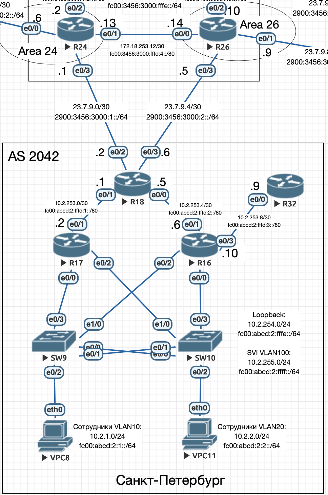

# Протокол EIGRP

## Цель

Настроить EIGRP в С.-Петербург, использовать named EIGRP

1. В офисе С.-Петербург настроить EIGRP.
2. R32 получает только маршрут по умолчанию.
3. R16-17 анонсируют только суммарные префиксы.
4. Использовать EIGRP named-mode для настройки сети.



## Настройка EIGRP

### Описание

1. На R18 настроим EIGRP, редистрибуция статических маршрутов по-умолчанию:

```
router eigrp PITER
 address-family ipv4 unicast autonomous-system 2042
  topology base
   redistribute static
  exit-af-topology
  network 10.2.253.0 0.0.0.3
  network 10.2.253.4 0.0.0.3
  network 10.2.254.18 0.0.0.0
  eigrp router-id 10.2.254.18
 exit-address-family
 address-family ipv6 unicast autonomous-system 2042
  topology base
   redistribute static
  exit-af-topology
  eigrp router-id 10.2.254.18
 exit-address-family
ip route 0.0.0.0 0.0.0.0 Null0
ipv6 route ::/0 Null0
```

2. На R17 настроим EIGRP, суммаризацию пользовательских сетей 10.2.0.0/22 и FC00:ABCD:2::/62:

```
router eigrp PITER
 address-family ipv4 unicast autonomous-system 2042
  af-interface Ethernet0/1
   summary-address 10.2.0.0 255.255.252.0
  exit-af-interface
  topology base
  exit-af-topology
  network 10.2.1.0 0.0.0.255
  network 10.2.2.0 0.0.0.255
  network 10.2.253.0 0.0.0.3
  network 10.2.254.17 0.0.0.0
  network 10.2.255.0 0.0.0.255
  eigrp router-id 10.2.254.17
 exit-address-family
 address-family ipv6 unicast autonomous-system 2042
  af-interface Ethernet0/1
   summary-address FC00:ABCD:2::/62
  exit-af-interface
  topology base
  exit-af-topology
  eigrp router-id 10.2.254.17
 exit-address-family
```

3. На R16 настроим EIGRP, суммаризацию пользовательских сетей 10.2.0.0/22 и FC00:ABCD:2::/62, а также ограничение анонса маршрута по префикс-листу ONLY-DEFAULT (по-умполчанию):

```
router eigrp PITER
 address-family ipv4 unicast autonomous-system 2042
  af-interface Ethernet0/1
   summary-address 10.2.0.0 255.255.252.0
  exit-af-interface
  topology base
   distribute-list route-map DEFAULT-ONLY out Ethernet0/3
  exit-af-topology
  network 10.2.1.0 0.0.0.255
  network 10.2.2.0 0.0.0.255
  network 10.2.253.4 0.0.0.3
  network 10.2.253.8 0.0.0.3
  network 10.2.254.16 0.0.0.0
  network 10.2.255.0 0.0.0.255
  eigrp router-id 10.2.254.16
 exit-address-family
 address-family ipv6 unicast autonomous-system 2042
  af-interface Ethernet0/1
   summary-address FC00:ABCD:2::/62
  exit-af-interface
  topology base
   distribute-list prefix-list ONLY-DEFAULT out Ethernet0/3
  exit-af-topology
  eigrp router-id 10.2.254.16
 exit-address-family
ip prefix-list ONLY-DEFAULT seq 5 permit 0.0.0.0/0
ipv6 prefix-list ONLY-DEFAULT seq 5 permit ::/0
route-map DEFAULT-ONLY permit 10
 match ip address prefix-list ONLY-DEFAULT
```

4. На R32 настроим EIGRP:

```
router eigrp PITER
 address-family ipv4 unicast autonomous-system 2042
  topology base
  exit-af-topology
  network 10.2.253.8 0.0.0.3
  network 10.2.254.32 0.0.0.0
  eigrp router-id 10.2.254.32
 exit-address-family
 address-family ipv6 unicast autonomous-system 2042
  topology base
  exit-af-topology
  eigrp router-id 10.2.254.32
 exit-address-family
```

Полные настройки устройств приведены в в конфигурационных [файлах](./conf).

## Проверка

Для проверки ВРЕМЕННО на R24 и R26 настроим статические маршруты до сетей Санкт-Петербурга:

R24:

```bash
ip route 10.2.0.0 255.255.0.0 Ethernet0/3
ipv6 route FC00:ABCD:2::/48 2900:3456:3000:1::2
```

R26:

```bash
ip route 10.2.0.0 255.255.0.0 Ethernet0/3
ipv6 route FC00:ABCD:2::/48 2900:3456:3000:2::6
```

### Маршрутизатор R17

Таблица маршрутизации:

```
R17#sh ip ro ei
Codes: L - local, C - connected, S - static, R - RIP, M - mobile, B - BGP
       D - EIGRP, EX - EIGRP external, O - OSPF, IA - OSPF inter area
       N1 - OSPF NSSA external type 1, N2 - OSPF NSSA external type 2
       E1 - OSPF external type 1, E2 - OSPF external type 2
       i - IS-IS, su - IS-IS summary, L1 - IS-IS level-1, L2 - IS-IS level-2
       ia - IS-IS inter area, * - candidate default, U - per-user static route
       o - ODR, P - periodic downloaded static route, H - NHRP, l - LISP
       a - application route
       + - replicated route, % - next hop override

Gateway of last resort is 10.2.253.1 to network 0.0.0.0

D*EX  0.0.0.0/0 [170/1024512] via 10.2.253.1, 00:45:15, Ethernet0/1
      10.0.0.0/8 is variably subnetted, 15 subnets, 4 masks
D        10.2.0.0/22 is a summary, 00:46:58, Null0
D        10.2.253.4/30 [90/1536000] via 10.2.255.16, 00:45:15, Ethernet0/0.100
                       [90/1536000] via 10.2.253.1, 00:45:15, Ethernet0/1
                       [90/1536000] via 10.2.2.16, 00:45:15, Ethernet0/2.20
                       [90/1536000] via 10.2.1.16, 00:45:15, Ethernet0/0.10
D        10.2.253.8/30 [90/1536000] via 10.2.255.16, 00:45:15, Ethernet0/0.100
                       [90/1536000] via 10.2.2.16, 00:45:15, Ethernet0/2.20
                       [90/1536000] via 10.2.1.16, 00:45:15, Ethernet0/0.10
D        10.2.254.16/32
           [90/1024640] via 10.2.255.16, 00:45:15, Ethernet0/0.100
           [90/1024640] via 10.2.2.16, 00:45:15, Ethernet0/2.20
           [90/1024640] via 10.2.1.16, 00:45:15, Ethernet0/0.10
D        10.2.254.18/32 [90/1024640] via 10.2.253.1, 00:45:15, Ethernet0/1
D        10.2.254.32/32
           [90/1536640] via 10.2.255.16, 00:45:15, Ethernet0/0.100
           [90/1536640] via 10.2.2.16, 00:45:15, Ethernet0/2.20
           [90/1536640] via 10.2.1.16, 00:45:15, Ethernet0/0.10

R17#sh ipv6 ro ei
IPv6 Routing Table - default - 19 entries
Codes: C - Connected, L - Local, S - Static, U - Per-user Static route
       B - BGP, HA - Home Agent, MR - Mobile Router, R - RIP
       H - NHRP, I1 - ISIS L1, I2 - ISIS L2, IA - ISIS interarea
       IS - ISIS summary, D - EIGRP, EX - EIGRP external, NM - NEMO
       ND - ND Default, NDp - ND Prefix, DCE - Destination, NDr - Redirect
       O - OSPF Intra, OI - OSPF Inter, OE1 - OSPF ext 1, OE2 - OSPF ext 2
       ON1 - OSPF NSSA ext 1, ON2 - OSPF NSSA ext 2, la - LISP alt
       lr - LISP site-registrations, ld - LISP dyn-eid, a - Application
EX  ::/0 [170/1024512]
     via FE80::A8BB:CCFF:FE01:2010, Ethernet0/1
D   2900:3456:3000:1::/64 [90/1536000]
     via FE80::A8BB:CCFF:FE01:2010, Ethernet0/1
D   2900:3456:3000:2::/64 [90/1536000]
     via FE80::A8BB:CCFF:FE01:2010, Ethernet0/1
D   FC00:ABCD:2::/62 [5/1024000]
     via Null0, directly connected
D   FC00:ABCD:2:FFFD:2::/80 [90/1536000]
     via FE80::A8BB:CCFF:FE01:2010, Ethernet0/1
     via FE80::A8BB:CCFF:FE01:0, Ethernet0/2.20
     via FE80::A8BB:CCFF:FE01:20, Ethernet0/0.10
     via FE80::A8BB:CCFF:FE01:20, Ethernet0/0.100
D   FC00:ABCD:2:FFFD:3::/80 [90/1536000]
     via FE80::A8BB:CCFF:FE01:0, Ethernet0/2.20
     via FE80::A8BB:CCFF:FE01:20, Ethernet0/0.10
     via FE80::A8BB:CCFF:FE01:20, Ethernet0/0.100
D   FC00:ABCD:2:FFFE::16/128 [90/1024640]
     via FE80::A8BB:CCFF:FE01:0, Ethernet0/2.20
     via FE80::A8BB:CCFF:FE01:20, Ethernet0/0.10
     via FE80::A8BB:CCFF:FE01:20, Ethernet0/0.100
D   FC00:ABCD:2:FFFE::18/128 [90/1024640]
     via FE80::A8BB:CCFF:FE01:2010, Ethernet0/1
D   FC00:ABCD:2:FFFE::32/128 [90/1536640]
     via FE80::A8BB:CCFF:FE01:20, Ethernet0/0.10
     via FE80::A8BB:CCFF:FE01:20, Ethernet0/0.100
     via FE80::A8BB:CCFF:FE01:0, Ethernet0/2.20
```

Пинг до внешних маршрутизаторов R24 и R26, а также до R32:

```
R17#ping 23.7.9.1
Type escape sequence to abort.
Sending 5, 100-byte ICMP Echos to 23.7.9.1, timeout is 2 seconds:
.!!!!
Success rate is 80 percent (4/5), round-trip min/avg/max = 1/1/1 ms

R17#ping 2900:3456:3000:1::1
Type escape sequence to abort.
Sending 5, 100-byte ICMP Echos to 2900:3456:3000:1::1, timeout is 2 seconds:
!!!!!
Success rate is 100 percent (5/5), round-trip min/avg/max = 1/1/1 ms

R17#ping 23.7.9.5
Type escape sequence to abort.
Sending 5, 100-byte ICMP Echos to 23.7.9.5, timeout is 2 seconds:
.!!!!
Success rate is 80 percent (4/5), round-trip min/avg/max = 1/1/1 ms

R17#ping 2900:3456:3000:2::5
Type escape sequence to abort.
Sending 5, 100-byte ICMP Echos to 2900:3456:3000:2::5, timeout is 2 seconds:
!!!!!
Success rate is 100 percent (5/5), round-trip min/avg/max = 1/1/1 ms

R17#ping 10.2.254.32
Type escape sequence to abort.
Sending 5, 100-byte ICMP Echos to 10.2.254.32, timeout is 2 seconds:
!!!!!
Success rate is 100 percent (5/5), round-trip min/avg/max = 1/1/2 ms

R17#ping FC00:ABCD:2:FFFE::32
Type escape sequence to abort.
Sending 5, 100-byte ICMP Echos to FC00:ABCD:2:FFFE::32, timeout is 2 seconds:
!!!!!
Success rate is 100 percent (5/5), round-trip min/avg/max = 1/12/20 ms
```

### Маршрутизатор R16

Таблица маршрутизации:

```
R16#sh ip ro ei
Codes: L - local, C - connected, S - static, R - RIP, M - mobile, B - BGP
       D - EIGRP, EX - EIGRP external, O - OSPF, IA - OSPF inter area
       N1 - OSPF NSSA external type 1, N2 - OSPF NSSA external type 2
       E1 - OSPF external type 1, E2 - OSPF external type 2
       i - IS-IS, su - IS-IS summary, L1 - IS-IS level-1, L2 - IS-IS level-2
       ia - IS-IS inter area, * - candidate default, U - per-user static route
       o - ODR, P - periodic downloaded static route, H - NHRP, l - LISP
       a - application route
       + - replicated route, % - next hop override

Gateway of last resort is 10.2.253.5 to network 0.0.0.0

D*EX  0.0.0.0/0 [170/1024512] via 10.2.253.5, 00:49:56, Ethernet0/1
      10.0.0.0/8 is variably subnetted, 16 subnets, 4 masks
D        10.2.0.0/22 is a summary, 01:58:26, Null0
D        10.2.253.0/30 [90/1536000] via 10.2.255.17, 00:49:56, Ethernet0/2.100
                       [90/1536000] via 10.2.253.5, 00:49:56, Ethernet0/1
                       [90/1536000] via 10.2.2.17, 00:49:56, Ethernet0/0.20
                       [90/1536000] via 10.2.1.17, 00:49:56, Ethernet0/2.10
D        10.2.254.17/32
           [90/1024640] via 10.2.255.17, 00:49:56, Ethernet0/2.100
           [90/1024640] via 10.2.2.17, 00:49:56, Ethernet0/0.20
           [90/1024640] via 10.2.1.17, 00:49:56, Ethernet0/2.10
D        10.2.254.18/32 [90/1024640] via 10.2.253.5, 00:49:56, Ethernet0/1
D        10.2.254.32/32 [90/1024640] via 10.2.253.9, 00:51:36, Ethernet0/3

R16#sh ipv6 ro ei
IPv6 Routing Table - default - 20 entries
Codes: C - Connected, L - Local, S - Static, U - Per-user Static route
       B - BGP, HA - Home Agent, MR - Mobile Router, R - RIP
       H - NHRP, I1 - ISIS L1, I2 - ISIS L2, IA - ISIS interarea
       IS - ISIS summary, D - EIGRP, EX - EIGRP external, NM - NEMO
       ND - ND Default, NDp - ND Prefix, DCE - Destination, NDr - Redirect
       O - OSPF Intra, OI - OSPF Inter, OE1 - OSPF ext 1, OE2 - OSPF ext 2
       ON1 - OSPF NSSA ext 1, ON2 - OSPF NSSA ext 2, la - LISP alt
       lr - LISP site-registrations, ld - LISP dyn-eid, a - Application
EX  ::/0 [170/1024512]
     via FE80::A8BB:CCFF:FE01:2000, Ethernet0/1
D   2900:3456:3000:1::/64 [90/1536000]
     via FE80::A8BB:CCFF:FE01:2000, Ethernet0/1
D   2900:3456:3000:2::/64 [90/1536000]
     via FE80::A8BB:CCFF:FE01:2000, Ethernet0/1
D   FC00:ABCD:2::/62 [5/1024000]
     via Null0, directly connected
D   FC00:ABCD:2:FFFD:1::/80 [90/1536000]
     via FE80::A8BB:CCFF:FE01:2000, Ethernet0/1
     via FE80::A8BB:CCFF:FE01:1000, Ethernet0/2.10
     via FE80::A8BB:CCFF:FE01:1000, Ethernet0/2.100
     via FE80::A8BB:CCFF:FE01:1020, Ethernet0/0.20
D   FC00:ABCD:2:FFFE::17/128 [90/1024640]
     via FE80::A8BB:CCFF:FE01:1000, Ethernet0/2.10
     via FE80::A8BB:CCFF:FE01:1000, Ethernet0/2.100
     via FE80::A8BB:CCFF:FE01:1020, Ethernet0/0.20
D   FC00:ABCD:2:FFFE::18/128 [90/1024640]
     via FE80::A8BB:CCFF:FE01:2000, Ethernet0/1
D   FC00:ABCD:2:FFFE::32/128 [90/1024640]
     via FE80::A8BB:CCFF:FE02:0, Ethernet0/3
```

Пинг до внешних маршрутизаторов R24 и R26, а также до R32 есть.

### Маршрутизатор R18

Таблица маршрутизации:

```
R18#sh ip ro ei
Codes: L - local, C - connected, S - static, R - RIP, M - mobile, B - BGP
       D - EIGRP, EX - EIGRP external, O - OSPF, IA - OSPF inter area
       N1 - OSPF NSSA external type 1, N2 - OSPF NSSA external type 2
       E1 - OSPF external type 1, E2 - OSPF external type 2
       i - IS-IS, su - IS-IS summary, L1 - IS-IS level-1, L2 - IS-IS level-2
       ia - IS-IS inter area, * - candidate default, U - per-user static route
       o - ODR, P - periodic downloaded static route, H - NHRP, l - LISP
       a - application route
       + - replicated route, % - next hop override

Gateway of last resort is 0.0.0.0 to network 0.0.0.0

      10.0.0.0/8 is variably subnetted, 11 subnets, 4 masks
D        10.2.0.0/22 [90/1536000] via 10.2.253.6, 00:54:13, Ethernet0/0
                     [90/1536000] via 10.2.253.2, 00:54:13, Ethernet0/1
D        10.2.253.8/30 [90/1536000] via 10.2.253.6, 00:54:11, Ethernet0/0
D        10.2.254.16/32 [90/1024640] via 10.2.253.6, 00:54:11, Ethernet0/0
D        10.2.254.17/32 [90/1024640] via 10.2.253.2, 00:54:11, Ethernet0/1
D        10.2.254.32/32 [90/1536640] via 10.2.253.6, 00:54:11, Ethernet0/0
D        10.2.255.0/24 [90/1536000] via 10.2.253.6, 00:52:32, Ethernet0/0
                       [90/1536000] via 10.2.253.2, 00:52:32, Ethernet0/1

R18#sh ipv6 ro ei
IPv6 Routing Table - default - 17 entries
Codes: C - Connected, L - Local, S - Static, U - Per-user Static route
       B - BGP, HA - Home Agent, MR - Mobile Router, R - RIP
       H - NHRP, I1 - ISIS L1, I2 - ISIS L2, IA - ISIS interarea
       IS - ISIS summary, D - EIGRP, EX - EIGRP external, NM - NEMO
       ND - ND Default, NDp - ND Prefix, DCE - Destination, NDr - Redirect
       O - OSPF Intra, OI - OSPF Inter, OE1 - OSPF ext 1, OE2 - OSPF ext 2
       ON1 - OSPF NSSA ext 1, ON2 - OSPF NSSA ext 2, la - LISP alt
       lr - LISP site-registrations, ld - LISP dyn-eid, a - Application
D   FC00:ABCD:2::/62 [90/1536000]
     via FE80::A8BB:CCFF:FE01:1010, Ethernet0/1
     via FE80::A8BB:CCFF:FE01:10, Ethernet0/0
D   FC00:ABCD:2:FFFD:3::/80 [90/1536000]
     via FE80::A8BB:CCFF:FE01:10, Ethernet0/0
D   FC00:ABCD:2:FFFE::16/128 [90/1024640]
     via FE80::A8BB:CCFF:FE01:10, Ethernet0/0
D   FC00:ABCD:2:FFFE::17/128 [90/1024640]
     via FE80::A8BB:CCFF:FE01:1010, Ethernet0/1
D   FC00:ABCD:2:FFFE::32/128 [90/1536640]
     via FE80::A8BB:CCFF:FE01:10, Ethernet0/0
D   FC00:ABCD:2:FFFF::/64 [90/1536000]
     via FE80::A8BB:CCFF:FE01:1010, Ethernet0/1
     via FE80::A8BB:CCFF:FE01:10, Ethernet0/0
```

Пинг до внешних маршрутизаторов R24 и R26, а также до R32 есть.

### Маршрутизатор R32

Таблица маршрутизации:

```
R32#sh ip ro ei
Codes: L - local, C - connected, S - static, R - RIP, M - mobile, B - BGP
       D - EIGRP, EX - EIGRP external, O - OSPF, IA - OSPF inter area
       N1 - OSPF NSSA external type 1, N2 - OSPF NSSA external type 2
       E1 - OSPF external type 1, E2 - OSPF external type 2
       i - IS-IS, su - IS-IS summary, L1 - IS-IS level-1, L2 - IS-IS level-2
       ia - IS-IS inter area, * - candidate default, U - per-user static route
       o - ODR, P - periodic downloaded static route, H - NHRP, l - LISP
       a - application route
       + - replicated route, % - next hop override

Gateway of last resort is 10.2.253.10 to network 0.0.0.0

D*EX  0.0.0.0/0 [170/1536512] via 10.2.253.10, 01:38:14, Ethernet0/0

R32#sh ipv6 ro ei
IPv6 Routing Table - default - 5 entries
Codes: C - Connected, L - Local, S - Static, U - Per-user Static route
       B - BGP, HA - Home Agent, MR - Mobile Router, R - RIP
       H - NHRP, I1 - ISIS L1, I2 - ISIS L2, IA - ISIS interarea
       IS - ISIS summary, D - EIGRP, EX - EIGRP external, NM - NEMO
       ND - ND Default, NDp - ND Prefix, DCE - Destination, NDr - Redirect
       O - OSPF Intra, OI - OSPF Inter, OE1 - OSPF ext 1, OE2 - OSPF ext 2
       ON1 - OSPF NSSA ext 1, ON2 - OSPF NSSA ext 2, la - LISP alt
       lr - LISP site-registrations, ld - LISP dyn-eid, a - Application
EX  ::/0 [170/1536512]
     via FE80::A8BB:CCFF:FE01:30, Ethernet0/0
```

Пинг до внешних маршрутизаторов R24 и R26, а также до R32 есть.
