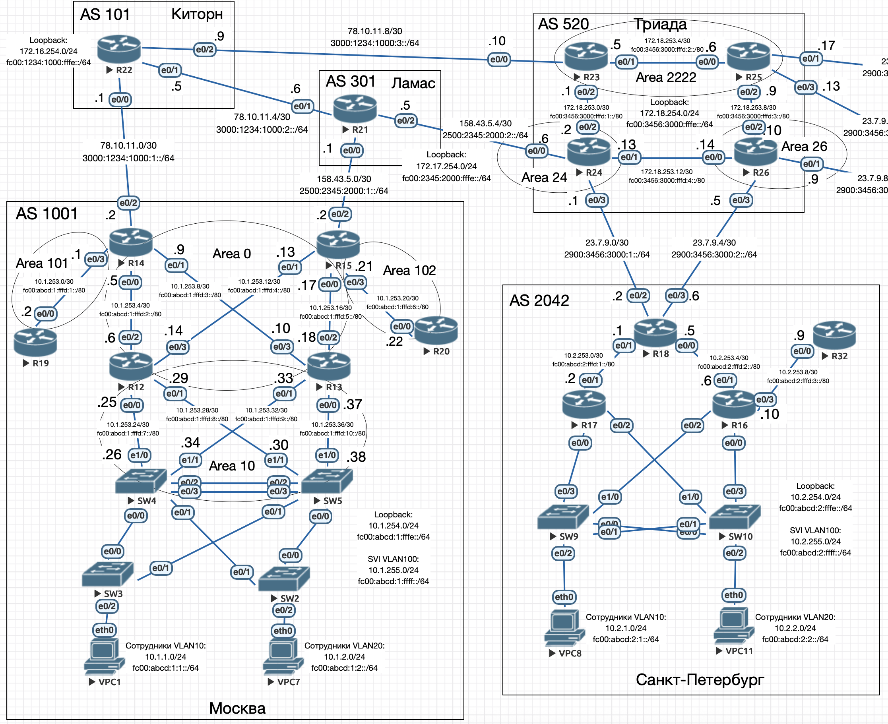

# Масштабируемость и дизайн iBGP

## Цель

Настроить iBGP в офисе Москва.
Настроить iBGP в сети провайдера Триада.
Организовать полную IP связанность всех сетей.

1. Настроите iBGP в офисом Москва между маршрутизаторами R14 и R15.
2. Настройте офиса Москва так, чтобы приоритетным провайдером стал Ламас.
3. Настроите iBGP в провайдере Триада, с использованием RR.
4. Настройте офиса С.-Петербург так, чтобы трафик до любого офиса распределялся по двум линкам одновременно.
5. Все сети в лабораторной работе должны иметь IP связность.



## Описание

1. В Москве приоритет настраивется параметром Local Prefernce
2. В Триада настраивается два Router Reflector на R23 и R25, удаляется редистрибюция для BGP в ISIS
3. В Санкт-Пертербурге балансировка настраивается:
    - На R18 командой ```maximum-paths 2```
    - Анонсом на "внешних" маршрутизаторах R24 и R26 только маршрута по-умолчанию

## Настройка

### Москва

#### R14

В OSPF настроена редистрибъюция маршрутов прямых соединени и поучаемых по BGP:

```
router ospfv3 1
 area 101 stub no-summary
 !
 address-family ipv4 unicast
  redistribute connected
  redistribute bgp 1001
 exit-address-family
 !
 address-family ipv6 unicast
  redistribute connected
  redistribute bgp 1001
 exit-address-family
```

Настроен iBGP с маршрутизатором R15 по loopback0 (10.1.254.15, FC00:ABCD:1:FFFE::15):

```
router bgp 1001
 bgp router-id 10.1.254.14
 bgp log-neighbor-changes
 neighbor 10.1.254.15 remote-as 1001
 neighbor 10.1.254.15 update-source Loopback0
 neighbor 3000:1234:1000:1::1 remote-as 101
 neighbor 78.10.11.1 remote-as 101
 neighbor FC00:ABCD:1:FFFE::15 remote-as 1001
 neighbor FC00:ABCD:1:FFFE::15 update-source Loopback0
 !
 address-family ipv4
  network 10.1.0.0 mask 255.255.0.0
  neighbor 10.1.254.15 activate
  no neighbor 3000:1234:1000:1::1 activate
  neighbor 78.10.11.1 activate
  no neighbor FC00:ABCD:1:FFFE::15 activate
 exit-address-family
 !
 address-family ipv6
  network FC00:ABCD:1::/48
  neighbor 3000:1234:1000:1::1 activate
  neighbor FC00:ABCD:1:FFFE::15 activate
 exit-address-family
 ```

Также настроен суммарный анонс сетей Москвы по BGP, для этого прописан маршрут в null0:

```
ip route 10.1.0.0 255.255.0.0 Null0
ipv6 route FC00:ABCD:1::/48 Null0
```

#### R15

Аналогично R14 в OSPF настроена редистрибъюция маршрутов прямых соединени и поучаемых по BGP.

Настроен iBGP с маршрутизатором R14 по loopback0 (10.1.254.14, FC00:ABCD:1:FFFE::14). 
Настроен route-map с установкой Local Preferennce: 150 для маршрутов получаемых от провайдера Ламас.
Благодаря этой настройке R15 анонсирует внешние маршруты в OSPF, на R14 внешние маршруты не анонсируются в OSPF,
поскольку они приходят по OSPF от R15, где административная дистанция ниже (OSPF 110 < iBGP 200):

```
router bgp 1001
 bgp router-id 10.1.254.15
 bgp log-neighbor-changes
 neighbor 10.1.254.14 remote-as 1001
 neighbor 10.1.254.14 update-source Loopback0
 neighbor 2500:2345:2000:1::1 remote-as 301
 neighbor 158.43.5.1 remote-as 301
 neighbor FC00:ABCD:1:FFFE::14 remote-as 1001
 neighbor FC00:ABCD:1:FFFE::14 update-source Loopback0
 !
 address-family ipv4
  network 10.1.0.0 mask 255.255.0.0
  neighbor 10.1.254.14 activate
  no neighbor 2500:2345:2000:1::1 activate
  neighbor 158.43.5.1 activate
  neighbor 158.43.5.1 route-map SET_LOCAL_PREF in
  no neighbor FC00:ABCD:1:FFFE::14 activate
 exit-address-family
 !
 address-family ipv6
  network FC00:ABCD:1::/48
  neighbor 2500:2345:2000:1::1 activate
  neighbor 2500:2345:2000:1::1 route-map SET_LOCAL_PREF in
  neighbor FC00:ABCD:1:FFFE::14 activate
 exit-address-family
 !
 route-map SET_LOCAL_PREF permit 10
 set local-preference 150
 ```

Также настроен суммарный анонс сетей Москвы по BGP, для этого прописан маршрут в null0:

```
ip route 10.1.0.0 255.255.0.0 Null0
ipv6 route FC00:ABCD:1::/48 Null0
```

### Триада

#### R23

```
router bgp 520
 neighbor TRIADA peer-group
 neighbor TRIADA remote-as 520
 neighbor TRIADA update-source Loopback0
 neighbor TRIADA6 peer-group
 neighbor TRIADA6 remote-as 520
 neighbor TRIADA6 update-source Loopback0
 ..
 neighbor 172.18.254.24 peer-group TRIADA
 neighbor 172.18.254.25 peer-group TRIADA
 neighbor 172.18.254.26 peer-group TRIADA
 neighbor FC00:3456:3000:FFFE::24 peer-group TRIADA6
 neighbor FC00:3456:3000:FFFE::25 peer-group TRIADA6
 neighbor FC00:3456:3000:FFFE::26 peer-group TRIADA6
 !
 address-family ipv4
  neighbor TRIADA route-reflector-client
  neighbor TRIADA next-hop-self
  ...
  neighbor 172.18.254.24 activate
  neighbor 172.18.254.25 activate
  neighbor 172.18.254.26 activate
  no neighbor FC00:3456:3000:FFFE::24 activate
  no neighbor FC00:3456:3000:FFFE::25 activate
  no neighbor FC00:3456:3000:FFFE::26 activate
 exit-address-family
 !
 address-family ipv6
  neighbor TRIADA6 route-reflector-client
  neighbor TRIADA6 next-hop-self
  ...
  neighbor FC00:3456:3000:FFFE::24 activate
  neighbor FC00:3456:3000:FFFE::25 activate
  neighbor FC00:3456:3000:FFFE::26 activate
 exit-address-family
```

#### R25

```
router bgp 520
 bgp router-id 172.18.254.25
 bgp log-neighbor-changes
 neighbor TRIADA peer-group
 neighbor TRIADA remote-as 520
 neighbor TRIADA update-source Loopback0
 neighbor TRIADA6 peer-group
 neighbor TRIADA6 remote-as 520
 neighbor TRIADA6 update-source Loopback0
 neighbor 172.18.254.23 peer-group TRIADA
 neighbor 172.18.254.24 peer-group TRIADA
 neighbor 172.18.254.26 peer-group TRIADA
 neighbor FC00:3456:3000:FFFE::23 peer-group TRIADA6
 neighbor FC00:3456:3000:FFFE::24 peer-group TRIADA6
 neighbor FC00:3456:3000:FFFE::26 peer-group TRIADA6
 !
 address-family ipv4
  neighbor TRIADA route-reflector-client
  neighbor TRIADA next-hop-self
  neighbor 172.18.254.23 activate
  neighbor 172.18.254.24 activate
  neighbor 172.18.254.26 activate
  no neighbor FC00:3456:3000:FFFE::23 activate
  no neighbor FC00:3456:3000:FFFE::24 activate
  no neighbor FC00:3456:3000:FFFE::26 activate
 exit-address-family
 !
 address-family ipv6
  neighbor TRIADA6 route-reflector-client
  neighbor TRIADA6 next-hop-self
  neighbor FC00:3456:3000:FFFE::23 activate
  neighbor FC00:3456:3000:FFFE::24 activate
  neighbor FC00:3456:3000:FFFE::26 activate
 exit-address-family
```

#### R24

Для ограничения анонса маршрута по-умолчанию создан ```route-map SEND-DEFAULT```

```
router bgp 520
 ...
 neighbor 172.18.254.23 remote-as 520
 neighbor 172.18.254.25 remote-as 520
 neighbor FC00:3456:3000:FFFE::23 remote-as 520
 neighbor FC00:3456:3000:FFFE::25 remote-as 520
 !
 address-family ipv4
  neighbor 23.7.9.2 default-originate
  neighbor 23.7.9.2 route-map SEND-DEFAULT out
  ...
  neighbor 172.18.254.23 activate
  neighbor 172.18.254.25 activate
  no neighbor FC00:3456:3000:FFFE::23 activate
  no neighbor FC00:3456:3000:FFFE::25 activate
 exit-address-family
 !
 address-family ipv6
  ...
  neighbor 2900:3456:3000:1::2 default-originate
  neighbor 2900:3456:3000:1::2 route-map SEND-DEFAULT out
  neighbor FC00:3456:3000:FFFE::23 activate
  neighbor FC00:3456:3000:FFFE::25 activate
 exit-address-family

ip route 0.0.0.0 0.0.0.0 Null0
ip route 172.18.0.0 255.255.0.0 Null0
!
!
ip prefix-list DEFAULT-ONLY seq 5 permit 0.0.0.0/0
ipv6 route FC00:3456:3000::/48 Null0
ipv6 route ::/0 Null0
!
!
ipv6 prefix-list DEFAULT-ONLY seq 5 permit ::/0
route-map SEND-DEFAULT permit 10
 match ip address prefix-list DEFAULT-ONLY
 match ipv6 address prefix-list DEFAULT-ONLY
```

#### R26

Для ограничения анонса маршрута по-умолчанию создан ```route-map SEND-DEFAULT```

```
router bgp 520
 ...
 neighbor 172.18.254.23 remote-as 520
 neighbor 172.18.254.25 remote-as 520
 neighbor FC00:3456:3000:FFFE::23 remote-as 520
 neighbor FC00:3456:3000:FFFE::25 remote-as 520
 !
 address-family ipv4
  neighbor 23.7.9.6 default-originate
  neighbor 23.7.9.6 route-map SEND-DEFAULT out
  ...
  neighbor 172.18.254.23 activate
  neighbor 172.18.254.25 activate
  no neighbor FC00:3456:3000:FFFE::23 activate
  no neighbor FC00:3456:3000:FFFE::25 activate
 exit-address-family
 !
 address-family ipv6
  ...
  neighbor 2900:3456:3000:2::6 default-originate
  neighbor 2900:3456:3000:2::6 route-map SEND-DEFAULT out
  neighbor FC00:3456:3000:FFFE::23 activate
  neighbor FC00:3456:3000:FFFE::25 activate
 exit-address-family

ip route 0.0.0.0 0.0.0.0 Null0
ip route 172.18.0.0 255.255.0.0 Null0
!
!
ip prefix-list DEFAULT-ONLY seq 5 permit 0.0.0.0/0
ipv6 route FC00:3456:3000::/48 Null0
ipv6 route ::/0 Null0
!
!
ipv6 prefix-list DEFAULT-ONLY seq 5 permit ::/0
route-map SEND-DEFAULT permit 10
 match ip address prefix-list DEFAULT-ONLY
 match ipv6 address prefix-list DEFAULT-ONLY
```

### Санкт-Петербург

#### R18

```
router bgp 2042
 address-family ipv4
  ...
  maximum-paths 2
 exit-address-family
 !
 address-family ipv6
  ...
  maximum-paths 2
 exit-address-family
```

Полные настройки устройств приведены в в конфигурационных [файлах](./conf).


## Проверка

### Проверка исходящего трафика из Москвы до внешних сетей (SW04 -> R17)

```
SW4#sh ip int br Loopback 0
Interface              IP-Address      OK? Method Status                Protocol
Loopback0              10.1.254.4      YES NVRAM  up                    up

SW4#sh ipv6 int br Loopback 0
Loopback0              [up/up]
    FE80::A8BB:CCFF:FE00:4000
    FC00:ABCD:1:FFFE::4

R17#sh ip int br Loopback 0
Interface                  IP-Address      OK? Method Status                Protocol
Loopback0                  10.2.254.17     YES NVRAM  up                    up

R17#sh ipv6 int br Loopback 0
Loopback0              [up/up]
    FE80::A8BB:CCFF:FE01:1000
    FC00:ABCD:2:FFFE::17
```

**До** настройки iBGP и Local Preference: 150 на R15:

```
SW4>traceroute 10.2.254.17
Type escape sequence to abort.
Tracing the route to 10.2.254.17
VRF info: (vrf in name/id, vrf out name/id)
  1 10.1.253.25 0 msec
    10.1.253.33 1 msec
    10.1.253.25 0 msec
  2 10.1.253.9 1 msec
    10.1.253.5 0 msec
    10.1.253.9 0 msec
  3 78.10.11.1 1 msec 1 msec 1 msec
  4 78.10.11.6 1 msec 1 msec 1 msec
  5 158.43.5.6 1 msec 1 msec 2 msec
  6 23.7.9.2 1 msec 1 msec 2 msec
  7 10.2.253.2 1 msec *  2 msec

SW4>traceroute FC00:ABCD:2:FFFE::17
Type escape sequence to abort.
Tracing the route to FC00:ABCD:2:FFFE::17

  1 FC00:ABCD:1:FFFD:9::33 0 msec
    FC00:ABCD:1:FFFD:7::25 1 msec
    FC00:ABCD:1:FFFD:9::33 0 msec
  2 FC00:ABCD:1:FFFD:2::5 1 msec
    FC00:ABCD:1:FFFD:3::9 0 msec
    FC00:ABCD:1:FFFD:2::5 1 msec
  3 3000:1234:1000:1::1 1 msec 0 msec 1 msec
  4 3000:1234:1000:2::6 1 msec 1 msec 0 msec
  5 2500:2345:2000:2::6 2 msec 1 msec 0 msec
  6 2900:3456:3000:1::2 2 msec 1 msec 1 msec
  7 FC00:ABCD:2:FFFD:1::2 1 msec 1 msec 1 msec
```

**После** настройки iBGP и Local Preference: 150 на R15:

```
SW4#traceroute 10.2.254.17
Type escape sequence to abort.
Tracing the route to 10.2.254.17
VRF info: (vrf in name/id, vrf out name/id)
  1 10.1.253.33 0 msec
    10.1.253.25 1 msec
    10.1.253.33 0 msec
  2 10.1.253.13 1 msec
    10.1.253.17 0 msec
    10.1.253.13 1 msec
  3 158.43.5.1 0 msec 0 msec 1 msec
  4 158.43.5.6 1 msec 1 msec 1 msec
  5 23.7.9.2 1 msec 1 msec 1 msec
  6 10.2.253.2 1 msec *  2 msec

SW4#traceroute FC00:ABCD:2:FFFE::17
Type escape sequence to abort.
Tracing the route to FC00:ABCD:2:FFFE::17

  1 FC00:ABCD:1:FFFD:7::25 18 msec
    FC00:ABCD:1:FFFD:9::33 17 msec
    FC00:ABCD:1:FFFD:7::25 0 msec
  2 FC00:ABCD:1:FFFD:5::17 1 msec
    FC00:ABCD:1:FFFD:4::13 0 msec
    FC00:ABCD:1:FFFD:5::17 0 msec
  3 2500:2345:2000:1::1 1 msec 0 msec 0 msec
  4 2500:2345:2000:2::6 1 msec 1 msec 1 msec
  5 2900:3456:3000:1::2 1 msec 1 msec 1 msec
  6 FC00:ABCD:2:FFFD:1::2 1 msec 1 msec 1 msec
```

Как видно после настройки трафик идёт через Ламас.

### Проверка iBGP в Триада

```
R23#sh bgp ipv4 unicast summary
BGP router identifier 172.18.254.23, local AS number 520
BGP table version is 197, main routing table version 197
20 network entries using 2800 bytes of memory
42 path entries using 3360 bytes of memory
10/7 BGP path/bestpath attribute entries using 1440 bytes of memory
2 BGP rrinfo entries using 48 bytes of memory
6 BGP AS-PATH entries using 144 bytes of memory
0 BGP route-map cache entries using 0 bytes of memory
0 BGP filter-list cache entries using 0 bytes of memory
BGP using 7792 total bytes of memory
BGP activity 48/8 prefixes, 178/94 paths, scan interval 60 secs

Neighbor        V           AS MsgRcvd MsgSent   TblVer  InQ OutQ Up/Down  State/PfxRcd
78.10.11.9      4          101     386     388      197    0    0 05:32:22        8
172.18.254.24   4          520      39      46      197    0    0 00:28:07       11
172.18.254.25   4          520     406     415      197    0    0 05:22:26       11
172.18.254.26   4          520      40      49      197    0    0 00:28:18        7

R23#sh bgp ipv6 unicast summary
BGP router identifier 172.18.254.23, local AS number 520
BGP table version is 197, main routing table version 197
20 network entries using 3280 bytes of memory
42 path entries using 4368 bytes of memory
10/7 BGP path/bestpath attribute entries using 1440 bytes of memory
2 BGP rrinfo entries using 48 bytes of memory
6 BGP AS-PATH entries using 144 bytes of memory
0 BGP route-map cache entries using 0 bytes of memory
0 BGP filter-list cache entries using 0 bytes of memory
BGP using 9280 total bytes of memory
BGP activity 48/8 prefixes, 178/94 paths, scan interval 60 secs

Neighbor        V           AS MsgRcvd MsgSent   TblVer  InQ OutQ Up/Down  State/PfxRcd
3000:1234:1000:3::9
                4          101     391     385      197    0    0 05:33:04        8
FC00:3456:3000:FFFE::24
                4          520      40      49      197    0    0 00:28:58       11
FC00:3456:3000:FFFE::25
                4          520     401     410      197    0    0 05:15:13       11
FC00:3456:3000:FFFE::26
                4          520      41      49      197    0    0 00:28:57        7

R25#sh bgp ipv4 unicast summary
BGP router identifier 172.18.254.25, local AS number 520
BGP table version is 143, main routing table version 143
20 network entries using 2800 bytes of memory
38 path entries using 3040 bytes of memory
7/6 BGP path/bestpath attribute entries using 1008 bytes of memory
2 BGP rrinfo entries using 48 bytes of memory
5 BGP AS-PATH entries using 120 bytes of memory
0 BGP route-map cache entries using 0 bytes of memory
0 BGP filter-list cache entries using 0 bytes of memory
BGP using 7016 total bytes of memory
BGP activity 51/11 prefixes, 218/142 paths, scan interval 60 secs

Neighbor        V           AS MsgRcvd MsgSent   TblVer  InQ OutQ Up/Down  State/PfxRcd
172.18.254.23   4          520     416     406      143    0    0 05:22:53       20
172.18.254.24   4          520      39      46      143    0    0 00:28:56       11
172.18.254.26   4          520     337     387      143    0    0 04:57:54        7

R25#sh bgp ipv6 unicast summary
BGP router identifier 172.18.254.25, local AS number 520
BGP table version is 140, main routing table version 140
20 network entries using 3280 bytes of memory
38 path entries using 3952 bytes of memory
7/6 BGP path/bestpath attribute entries using 1008 bytes of memory
2 BGP rrinfo entries using 48 bytes of memory
5 BGP AS-PATH entries using 120 bytes of memory
0 BGP route-map cache entries using 0 bytes of memory
0 BGP filter-list cache entries using 0 bytes of memory
BGP using 8408 total bytes of memory
BGP activity 51/11 prefixes, 218/142 paths, scan interval 60 secs

Neighbor        V           AS MsgRcvd MsgSent   TblVer  InQ OutQ Up/Down  State/PfxRcd
FC00:3456:3000:FFFE::23
                4          520     411     401      140    0    0 05:15:39       20
FC00:3456:3000:FFFE::24
                4          520      40      46      140    0    0 00:29:33       11
FC00:3456:3000:FFFE::26
                4          520     341     394      140    0    0 05:00:50        7
```

### Проверка балансировки трафика в Санкт-Петербурге

```
R18#sh ip route bgp
Codes: L - local, C - connected, S - static, R - RIP, M - mobile, B - BGP
       D - EIGRP, EX - EIGRP external, O - OSPF, IA - OSPF inter area
       N1 - OSPF NSSA external type 1, N2 - OSPF NSSA external type 2
       E1 - OSPF external type 1, E2 - OSPF external type 2
       i - IS-IS, su - IS-IS summary, L1 - IS-IS level-1, L2 - IS-IS level-2
       ia - IS-IS inter area, * - candidate default, U - per-user static route
       o - ODR, P - periodic downloaded static route, H - NHRP, l - LISP
       a - application route
       + - replicated route, % - next hop override

Gateway of last resort is 23.7.9.5 to network 0.0.0.0

B*    0.0.0.0/0 [20/0] via 23.7.9.5, 00:30:38
                [20/0] via 23.7.9.1, 00:30:38
```
