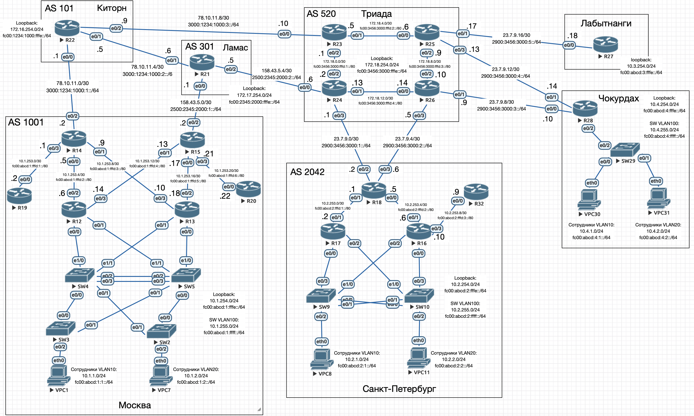
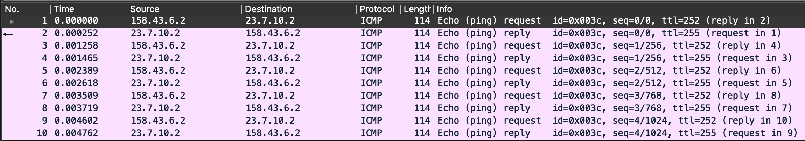
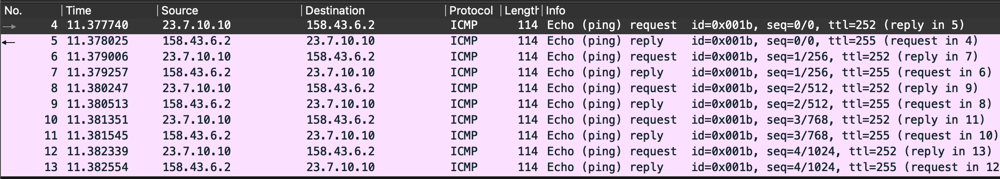

# Основные протоколы сети интернет

## Цель

Настроить DHCP в офисе Москва.
Настроить синхронизацию времени в офисе Москва.
Настроить NAT в офисе Москва, C.-Перетбруг и Чокурдах

1. Настроите NAT(PAT) на R14 и R15. Трансляция должна осуществляться в адрес автономной системы AS1001.
2. Настроите NAT(PAT) на R18. Трансляция должна осуществляться в пул из 5 адресов автономной системы AS2042.
3. Настроите статический NAT для R20.
4. Настроите NAT так, чтобы R19 был доступен с любого узла для удаленного управления.
   5*. Настроите статический NAT(PAT) для офиса Чокурдах.
5. Настроите для IPv4 DHCP сервер в офисе Москва на маршрутизаторах R12 и R13. VPC1 и VPC7 должны получать сетевые настройки по DHCP.
6. Настроите NTP сервер на R12 и R13. Все устройства в офисе Москва должны синхронизировать время с R12 и R13.
7. Все сети в лабораторной работе должны иметь IP связность.



## Описание

1. Между Москвой и Киторн сеть расширена до 78.10.12.0/24, сделан PAT для всей сети Москвы 10.1.0.0/24 в Ethernet0/2 (R14 и R15)
2. Между Санкт-Петербургом и Триадой расширены сети до /24, сделан PAT для всех внутренних адресов в пул из 5 внешних адресов 23.7.10.10-23.7.10.14 на интерфейсе R18 e0/2
3. Между Москвой и Ламас сеть расширена до 158.43.6.0/24, сделан статический NAT 10.1.253.22 (R20) в 158.43.6.3 (R15)
4. На R19 настроен SSH-сервер, настроен PAT внутреннего IP-адреса R19 10.1.253.2 на 22/tcp с внешнего IP 78.10.12.3 с 22/tcp
5. Поскольку SW4 и SW5 настроены как L3-коммутаторы, то DHCP настроен именно там.


## Настройка

### Москва

#### R14

```
interface Ethernet0/0
 ip nat inside
!
interface Ethernet0/1
 ip nat inside
!
interface Ethernet0/2
 ip address 78.10.12.2 255.255.255.0
 ip nat outside
!
interface Ethernet0/3
 ip nat inside

ip nat inside source list 101 interface Ethernet0/2 overload
ip nat inside source static tcp 10.1.253.2 22 78.10.12.3 22 extendable
```

#### R15

```
interface Ethernet0/0
 ip nat inside
!
interface Ethernet0/1
 ip nat inside
!
interface Ethernet0/2
 ip address 158.43.6.2 255.255.255.0
 ip nat outside
!
interface Ethernet0/3
 ip nat inside

ip nat inside source list 101 interface Ethernet0/2 overload
ip nat inside source static 10.1.253.22 158.43.6.3
```

#### R19

```
ip domain name linux.technology
username admin privilege 15 secret 5 $1$7dWf$KpxxUPT42rqUpu5xWKaKu/
ip ssh version 2
line vty 0 4
 login local
 transport input ssh
```

#### Настройка DHCP-сервера на SW4

```
ip dhcp pool VLAN10
 network 10.1.1.0 255.255.255.0
 default-router 10.1.1.1
 domain-name moscow.linux.technology
 dns-server 10.1.1.1
 option 42 ip 10.1.254.12
```

#### Настройка DHCP-сервера на SW5

```
ip dhcp pool VLAN20
 network 10.1.2.0 255.255.255.0
 default-router 10.1.2.1
 domain-name moscow.linux.technology
 dns-server 10.1.2.1
 option 42 ip 10.1.254.13
```

#### Настройка NTP-сервера на R12

```
clock timezone MSK 3 0
ntp master 3
ntp peer 10.1.254.13
```

#### Настройка NTP-сервера на R13

```
clock timezone MSK 3 0
ntp master 3
ntp peer 10.1.254.12
```

На остальных устройствах прописывается:

```
ntp server 10.1.254.12
ntp server 10.1.254.13
```

### Санкт-Петербург

#### R18

```
interface Ethernet0/0
 ip nat inside
!
interface Ethernet0/1
 ip nat inside
!
interface Ethernet0/2
 ip nat outside

ip nat pool POOL-LINK1 23.7.10.10 23.7.10.14 prefix-length 24
ip nat inside source list 1 pool POOL-LINK1 overload
```

Полные настройки устройств приведены в в конфигурационных [файлах](./conf).

## Проверка

### Проверка PAT на R15

С R12 пропингуем внешний интерфейс R18 e0/2

```
R12>ping 23.7.10.2
Type escape sequence to abort.
Sending 5, 100-byte ICMP Echos to 23.7.10.2, timeout is 2 seconds:
!!!!!
Success rate is 100 percent (5/5), round-trip min/avg/max = 1/1/2 ms
```

На рисунке видно, внутренний IP 10.1.253.14 транслируется в 158.43.6.2



На R15:

```
R15#sh ip nat translations
Pro Inside global      Inside local       Outside local      Outside global
icmp 158.43.6.2:60     10.1.253.14:60     23.7.10.2:60       23.7.10.2:60
--- 158.43.6.3         10.1.253.22        ---                ---
```

С R17 пропингуем внешний интерфейс R15 e0/2

```
R17>ping 158.43.6.2
Type escape sequence to abort.
Sending 5, 100-byte ICMP Echos to 158.43.6.2, timeout is 2 seconds:
!!!!!
Success rate is 100 percent (5/5), round-trip min/avg/max = 1/1/2 ms
```

На рисунке видно, внутренний IP 10.2.253.2 транслируется в 23.7.10.10



На R18:

```
R18#sh ip nat translations
Pro Inside global      Inside local       Outside local      Outside global
icmp 23.7.10.10:27     10.2.253.2:27      158.43.6.2:27      158.43.6.2:27
```

### Проверка проброса 22/tcp на R19

С роутера R22 необходимо зайти на R19 по внешнему адресу с R22:

```
R22>ssh -l admin 78.10.12.3
Password:
R19#
```

### Проверка DHCP

```
VPC1> ip dhcp
DDORA IP 10.1.1.2/24 GW 10.1.1.1

VPC7> ip dhcp
DDORA IP 10.1.2.2/24 GW 10.1.2.1
```

### Проверка NTP

На сервере:

```
R12#sh ntp status
Clock is synchronized, stratum 3, reference is 127.127.1.1
nominal freq is 250.0000 Hz, actual freq is 250.0000 Hz, precision is 2**10
ntp uptime is 46500 (1/100 of seconds), resolution is 4000
reference time is EC4C5526.BCAC0A38 (16:18:30.737 MSK Sun Aug 17 2025)
clock offset is 0.0000 msec, root delay is 0.00 msec
root dispersion is 2.37 msec, peer dispersion is 1.20 msec
loopfilter state is 'CTRL' (Normal Controlled Loop), drift is 0.000000000 s/s
system poll interval is 16, last update was 14 sec ago.
```

На клиенте:

```
R14#sh ntp associations

  address         ref clock       st   when   poll reach  delay  offset   disp
*~10.1.254.12     127.127.1.1      3     16     64     1  0.000   0.000 189.46
+~10.1.254.13     127.127.1.1      3     13     64     1  0.000   0.000 189.46
 * sys.peer, # selected, + candidate, - outlyer, x falseticker, ~ configured
```
