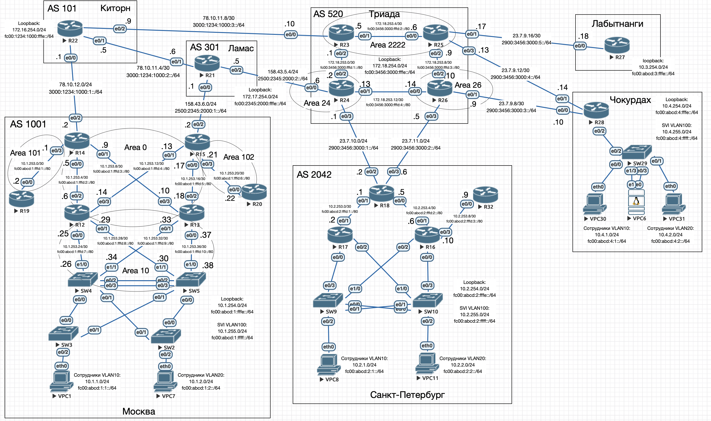

# Виртуальная частные сети - VPN

## Цель

Настроить GRE между офисами Москва и С.-Петербург.
Настроить DMVPN между офисами Москва и Чокурдах, Лабытнанги.

1. Настроите GRE между офисами Москва и С.-Петербург.
2. Настроите DMVMN между Москва и Чокурдах, Лабытнанги.
3. Все узлы в офисах в лабораторной работе должны иметь IP связность.



## Описание

1. Настроены 2 туннеля GRE: 
   - R14 e0/2 -> R18 e0/2, IP: 10.0.0.0/30
   - R15 e0/2 -> R18 e0/3, IP: 10.0.1.0/30
2. Настроен BGP между R14-R18 и R15-R18, и поскольку сети Москвы 10.1.0.0/16 и Санкт-Петербурга 10.2.0.0/16 
имеют больший приоритет чем 0.0.0.0/0, то весь трафик между офисами будет идти через GRE-туннель.
3. DMVPN настроены на R14 и R15 (Москва), R27 (Лабытнанги) и R28 (Чокурдах). Для DMVPN выделена сеть 10.100.0.0/16

## Настройка GRE туннелей между офисами Москва и Санкт-Петербург

### Москва

#### R14

```
interface Tunnel0
 ip address 10.0.1.1 255.255.255.252
 tunnel source Ethernet0/2
 tunnel destination 23.7.11.6

router bgp 1001
 neighbor 10.0.1.2 remote-as 2042
 neighbor 10.0.1.2 update-source Tunnel0
 !
 address-family ipv4
  network 10.1.0.0 mask 255.255.0.0
  neighbor 10.0.1.2 activate
 exit-address-family
```

#### R15

```
interface Tunnel0
 ip address 10.0.0.1 255.255.255.252
 tunnel source Ethernet0/2
 tunnel destination 23.7.10.2

router bgp 1001
 neighbor 10.0.0.2 remote-as 2042
 neighbor 10.0.0.2 update-source Tunnel0
 !
 address-family ipv4
  neighbor 10.0.0.2 activate
  neighbor 10.0.0.2 route-map SET_LOCAL_PREF in
 exit-address-family

 route-map SET_LOCAL_PREF permit 10
 set local-preference 150
```

### Санкт-Петербург

#### R18

```
interface Tunnel0
 ip address 10.0.0.2 255.255.255.252
 tunnel source Ethernet0/2
 tunnel destination 158.43.6.2
!
interface Tunnel1
 ip address 10.0.1.2 255.255.255.252
 tunnel source Ethernet0/3
 tunnel destination 78.10.12.2

router bgp 2042
 neighbor 10.0.0.1 remote-as 1001
 neighbor 10.0.0.1 update-source Tunnel0
 neighbor 10.0.1.1 remote-as 1001
 neighbor 10.0.1.1 update-source Tunnel0
 !
 address-family ipv4
  neighbor 10.0.0.1 activate
  neighbor 10.0.1.1 activate
 exit-address-family
```

## Настройка DMVMN между Москва и Чокурдах, Лабытнанги

### Москва

#### R14

```
interface Tunnel1
 ip address 10.100.0.2 255.255.0.0
 no ip redirects
 ip nhrp authentication OTUS
 ip nhrp map multicast dynamic
 ip nhrp network-id 1
 ip nhrp redirect
 tunnel source Ethernet0/2
 tunnel mode gre multipoint
 tunnel key 1
```

#### R15

```
interface Tunnel1
 ip address 10.100.0.1 255.255.0.0
 no ip redirects
 ip nhrp authentication OTUS
 ip nhrp map multicast dynamic
 ip nhrp network-id 1
 ip nhrp redirect
 tunnel source Ethernet0/2
 tunnel mode gre multipoint
 tunnel key 1
```

### Лабытнанги

#### R27

```
interface Tunnel0
 ip address 10.100.0.20 255.255.0.0
 no ip redirects
 ip nhrp authentication OTUS
 ip nhrp map 10.100.0.1 158.43.6.2
 ip nhrp map 10.100.0.2 78.10.12.2
 ip nhrp map multicast 158.43.6.2
 ip nhrp map multicast 78.10.12.2
 ip nhrp network-id 1
 ip nhrp nhs 10.100.0.1
 ip nhrp nhs 10.100.0.2
 ip nhrp shortcut
 tunnel source Ethernet0/0
 tunnel mode gre multipoint
 tunnel key 1
```

### Чокурдах

#### R28

```
interface Tunnel0
 ip address 10.100.0.10 255.255.0.0
 no ip redirects
 ip nhrp authentication OTUS
 ip nhrp map 10.100.0.1 158.43.6.2
 ip nhrp map 10.100.0.2 78.10.12.2
 ip nhrp map multicast 158.43.6.2
 ip nhrp map multicast 78.10.12.2
 ip nhrp network-id 1
 ip nhrp nhs 10.100.0.1
 ip nhrp nhs 10.100.0.2
 ip nhrp shortcut
 tunnel source Ethernet0/0
 tunnel mode gre multipoint
 tunnel key 1
```

Полные настройки устройств приведены в в конфигурационных [файлах](./conf).

## Проверка

### GRE между офисами Москва и С.-Петербург

Маршрут с R15 из Москвы до сети 10.2.0.0/16 идет через туннель 10.0.0.0/30.
С R14 маршрут идет через R15, покльку на R15 Local Preference: 150

```
R15#sh ip route bgp
Codes: L - local, C - connected, S - static, R - RIP, M - mobile, B - BGP
       D - EIGRP, EX - EIGRP external, O - OSPF, IA - OSPF inter area
       N1 - OSPF NSSA external type 1, N2 - OSPF NSSA external type 2
       E1 - OSPF external type 1, E2 - OSPF external type 2
       i - IS-IS, su - IS-IS summary, L1 - IS-IS level-1, L2 - IS-IS level-2
       ia - IS-IS inter area, * - candidate default, U - per-user static route
       o - ODR, P - periodic downloaded static route, H - NHRP, l - LISP
       a - application route
       + - replicated route, % - next hop override

Gateway of last resort is 158.43.6.1 to network 0.0.0.0

B*    0.0.0.0/0 [20/0] via 158.43.6.1, 00:27:59
      10.0.0.0/8 is variably subnetted, 28 subnets, 4 masks
B        10.2.0.0/16 [20/0] via 10.0.0.2, 00:27:59

R14#sh ip route 10.2.0.0 255.255.0.0
Routing entry for 10.2.0.0/16
  Known via "ospfv3 1", distance 110, metric 1
  Tag 2042, type extern 2, forward metric 20
  Last update from 10.1.253.6 on Ethernet0/0, 00:29:30 ago
  Routing Descriptor Blocks:
  * 10.1.253.10, from 10.1.254.15, 00:29:30 ago, via Ethernet0/1
      Route metric is 1, traffic share count is 1
      Route tag 2042
    10.1.253.6, from 10.1.254.15, 00:29:30 ago, via Ethernet0/0
      Route metric is 1, traffic share count is 1
      Route tag 2042
```

Трейс с R12 до R17 и наоборот:

```
R12>traceroute 10.2.254.17
Type escape sequence to abort.
Tracing the route to 10.2.254.17
VRF info: (vrf in name/id, vrf out name/id)
  1 10.1.253.13 0 msec 1 msec 0 msec
  2 10.0.0.2 1 msec 2 msec 1 msec
  3 10.2.253.2 2 msec *  2 msec

R17>traceroute 10.1.254.12
Type escape sequence to abort.
Tracing the route to 10.1.254.12
VRF info: (vrf in name/id, vrf out name/id)
  1 10.2.253.1 0 msec 1 msec 0 msec
  2 10.0.0.1 1 msec 1 msec 1 msec
  3 10.1.253.14 2 msec *  1 msec
```

### DMVPN между офисами Москва и Чокурдах, Лабытнанги

```
R14#show dmvpn
Legend: Attrb --> S - Static, D - Dynamic, I - Incomplete
	N - NATed, L - Local, X - No Socket
	# Ent --> Number of NHRP entries with same NBMA peer
	NHS Status: E --> Expecting Replies, R --> Responding, W --> Waiting
	UpDn Time --> Up or Down Time for a Tunnel
==========================================================================

Interface: Tunnel1, IPv4 NHRP Details
Type:Hub, NHRP Peers:2,

 # Ent  Peer NBMA Addr Peer Tunnel Add State  UpDn Tm Attrb
 ----- --------------- --------------- ----- -------- -----
     1 23.7.9.10           10.100.0.10    UP 00:19:20     D
     1 23.7.9.18           10.100.0.20    UP 00:16:26     D

R14#show ip nhrp
10.100.0.10/32 via 10.100.0.10
   Tunnel1 created 00:19:23, expire 01:40:36
   Type: dynamic, Flags: unique registered used nhop
   NBMA address: 23.7.9.10
10.100.0.20/32 via 10.100.0.20
   Tunnel1 created 00:16:29, expire 01:51:50
   Type: dynamic, Flags: unique registered used nhop
   NBMA address: 23.7.9.18


R15#show dmvpn
Legend: Attrb --> S - Static, D - Dynamic, I - Incomplete
	N - NATed, L - Local, X - No Socket
	# Ent --> Number of NHRP entries with same NBMA peer
	NHS Status: E --> Expecting Replies, R --> Responding, W --> Waiting
	UpDn Time --> Up or Down Time for a Tunnel
==========================================================================

Interface: Tunnel1, IPv4 NHRP Details
Type:Hub, NHRP Peers:2,

 # Ent  Peer NBMA Addr Peer Tunnel Add State  UpDn Tm Attrb
 ----- --------------- --------------- ----- -------- -----
     1 23.7.9.10           10.100.0.10    UP 00:19:35     D
     1 23.7.9.18           10.100.0.20    UP 00:16:40     D

R15#show ip nhrp
10.100.0.10/32 via 10.100.0.10
   Tunnel1 created 00:19:35, expire 01:40:24
   Type: dynamic, Flags: unique registered used nhop
   NBMA address: 23.7.9.10
10.100.0.20/32 via 10.100.0.20
   Tunnel1 created 00:16:40, expire 01:53:14
   Type: dynamic, Flags: unique registered used nhop
   NBMA address: 23.7.9.18


R27#show dmvpn
Legend: Attrb --> S - Static, D - Dynamic, I - Incomplete
	N - NATed, L - Local, X - No Socket
	# Ent --> Number of NHRP entries with same NBMA peer
	NHS Status: E --> Expecting Replies, R --> Responding, W --> Waiting
	UpDn Time --> Up or Down Time for a Tunnel
==========================================================================

Interface: Tunnel0, IPv4 NHRP Details
Type:Spoke, NHRP Peers:3,

 # Ent  Peer NBMA Addr Peer Tunnel Add State  UpDn Tm Attrb
 ----- --------------- --------------- ----- -------- -----
     1 158.43.6.2           10.100.0.1    UP 00:07:24     S
     1 78.10.12.2           10.100.0.2    UP 00:09:00     S
     1 23.7.9.10           10.100.0.10    UP 00:05:53     D

R27#show ip nhrp
10.100.0.1/32 via 10.100.0.1
   Tunnel0 created 00:17:20, never expire
   Type: static, Flags: used
   NBMA address: 158.43.6.2
10.100.0.2/32 via 10.100.0.2
   Tunnel0 created 00:17:20, never expire
   Type: static, Flags: used
   NBMA address: 78.10.12.2
10.100.0.10/32 via 10.100.0.10
   Tunnel0 created 00:05:53, expire 01:54:06
   Type: dynamic, Flags: router used nhop
   NBMA address: 23.7.9.10
10.100.0.20/32 via 10.100.0.20
   Tunnel0 created 00:05:53, expire 01:54:06
   Type: dynamic, Flags: router unique local
   NBMA address: 23.7.9.18
    (no-socket)

R28#show dmvpn
Legend: Attrb --> S - Static, D - Dynamic, I - Incomplete
	N - NATed, L - Local, X - No Socket
	# Ent --> Number of NHRP entries with same NBMA peer
	NHS Status: E --> Expecting Replies, R --> Responding, W --> Waiting
	UpDn Time --> Up or Down Time for a Tunnel
==========================================================================

Interface: Tunnel0, IPv4 NHRP Details
Type:Spoke, NHRP Peers:3,

 # Ent  Peer NBMA Addr Peer Tunnel Add State  UpDn Tm Attrb
 ----- --------------- --------------- ----- -------- -----
     1 158.43.6.2           10.100.0.1    UP 00:20:43     S
     1 78.10.12.2           10.100.0.2    UP 00:20:43     S
     1 23.7.9.18           10.100.0.20    UP 00:06:22     D

R28#show ip nhrp
10.100.0.1/32 via 10.100.0.1
   Tunnel0 created 00:20:44, never expire
   Type: static, Flags: used
   NBMA address: 158.43.6.2
10.100.0.2/32 via 10.100.0.2
   Tunnel0 created 00:20:44, never expire
   Type: static, Flags: used
   NBMA address: 78.10.12.2
10.100.0.10/32 via 10.100.0.10
   Tunnel0 created 00:06:22, expire 01:53:37
   Type: dynamic, Flags: router unique local
   NBMA address: 23.7.9.10
    (no-socket)
10.100.0.20/32 via 10.100.0.20
   Tunnel0 created 00:06:22, expire 01:53:37
   Type: dynamic, Flags: router used nhop
   NBMA address: 23.7.9.18
```

Трейс до другого спока идет напрямую

```
R27#sh ip int br tunnel 0
Interface                  IP-Address      OK? Method Status                Protocol
Tunnel0                    10.100.0.20     YES manual up                    up

R27#traceroute 10.100.0.10
Type escape sequence to abort.
Tracing the route to 10.100.0.10
VRF info: (vrf in name/id, vrf out name/id)
  1 10.100.0.10 1 msec 1 msec *
```
