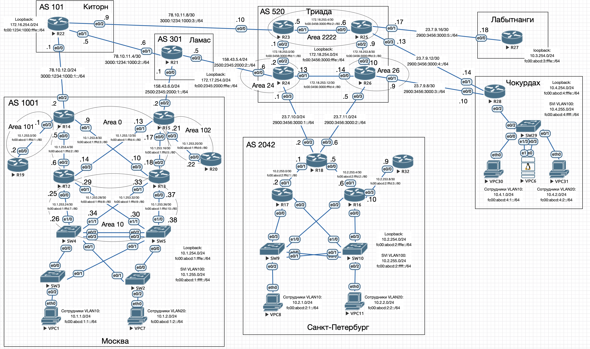

# IPSec

## Цель

Настроить GRE поверх IPSec между офисами Москва и С.-Петербург
Настроить DMVPN поверх IPSec между офисами Москва и Чокурдах, Лабытнанги

1. Настроите GRE поверх IPSec между офисами Москва и С.-Петербург.
2. Настроите DMVPN поверх IPSec между Москва и Чокурдах, Лабытнанги.
3. Все узлы в офисах в лабораторной работе должны иметь IP связность.



## Описание

1. Настроим IPSec (IKEv2) для маршрутизатора R15 (Москва) и R18 (Санкт-Петербург)
2. Также настроим IPSec (IKEv2) для маршрутизатора R15 (Москва) и R27 и R28


## Настройка GRE туннелей между офисами Москва и Санкт-Петербург

### Москва

#### R15

```
crypto ikev2 proposal IKEv2-PROPOSAL
 encryption aes-cbc-256
 integrity sha256
 group 14
!
crypto ikev2 policy IKEv2-POLICY
 proposal IKEv2-PROPOSAL
!
crypto ikev2 keyring IKEv2-KEYRING
 peer R18
  address 23.7.10.2
  pre-shared-key OTUS
!
!
crypto ikev2 profile IKEv2-PROFILE
 match identity remote address 23.7.10.2 255.255.255.255
 authentication remote pre-share
 authentication local pre-share
 keyring local IKEv2-KEYRING
!
!
!
crypto ipsec transform-set IPSec-TRANSFORM esp-aes 256 esp-sha256-hmac
 mode tunnel
!
crypto ipsec profile IPSec-PROFILE
 set transform-set IPSec-TRANSFORM
 set ikev2-profile IKEv2-PROFILE

interface Tunnel0
 tunnel protection ipsec profile IPSec-PROFILE
```

### Санкт-Петербург

#### R18

```
crypto ikev2 proposal IKEv2-PROPOSAL
 encryption aes-cbc-256
 integrity sha256
 group 14
!
crypto ikev2 policy IKEv2-POLICY
 proposal IKEv2-PROPOSAL
!
crypto ikev2 keyring IKEv2-KEYRING
 peer R15
  address 158.43.6.2
  pre-shared-key OTUS
 !
!
!
crypto ikev2 profile IKEv2-PROFILE
 match identity remote address 158.43.6.2 255.255.255.255
 authentication remote pre-share
 authentication local pre-share
 keyring local IKEv2-KEYRING
!
!
!
crypto ipsec transform-set IPSec-TRANSFORM esp-aes 256 esp-sha256-hmac
 mode tunnel
!
crypto ipsec profile IPSec-PROFILE
 set transform-set IPSec-TRANSFORM
 set ikev2-profile IKEv2-PROFILE

interface Tunnel0
 tunnel protection ipsec profile IPSec-PROFILE
```

## Настройка DMVMN между Москва и Чокурдах, Лабытнанги

### Москва

#### R15

```
crypto ikev2 keyring IKEv2-KEYRING-ANY
 peer ANY
  address 0.0.0.0 0.0.0.0
  pre-shared-key OTUS

crypto ikev2 profile IKEv2-PROFILE-ANY
 match identity remote any
 authentication remote pre-share
 authentication local pre-share
 keyring local IKEv2-KEYRING-ANY

crypto ipsec profile IPSEC-PROFILE-ANY
 set transform-set IPSec-TRANSFORM
 set ikev2-profile IKEv2-PROFILE-ANY

interface Tunnel1
 tunnel protection ipsec profile IPSEC-PROFILE-ANY
```

### Лабытнанги и Чокурдах

Настройки идентичные

#### R27 и R28

```
crypto ikev2 proposal IKEv2-PROPOSAL
 encryption aes-cbc-256
 integrity sha256
 group 14
!
crypto ikev2 policy IKEv2-POLICY
 proposal IKEv2-PROPOSAL
!
crypto ikev2 keyring IKEv2-KEYRING-ANY
 peer ANY
  address 0.0.0.0 0.0.0.0
  pre-shared-key OTUS
 !
!
!
crypto ikev2 profile IKEv2-PROFILE-ANY
 match identity remote any
 authentication remote pre-share
 authentication local pre-share
 keyring local IKEv2-KEYRING-ANY
!
!
!
crypto ipsec transform-set IPSec-TRANSFORM esp-aes 256 esp-sha256-hmac
 mode tunnel
!
crypto ipsec profile IPSEC-PROFILE-ANY
 set transform-set IPSec-TRANSFORM
 set ikev2-profile IKEv2-PROFILE-ANY

interface Tunnel0
 tunnel protection ipsec profile IPSEC-PROFILE-ANY
```

Полные настройки ВСЕХ устройств приведены в в конфигурационных [файлах](./conf).

## Проверка

### GRE с IPSec между офисами Москва и С.-Петербург

На одном из маршрутищаторов:

```
R15#show crypto ikev2 sa
 IPv4 Crypto IKEv2  SA

Tunnel-id Local                 Remote                fvrf/ivrf            Status
1         158.43.6.2/500        23.7.10.2/500         none/none            READY
      Encr: AES-CBC, keysize: 256, PRF: SHA256, Hash: SHA256, DH Grp:14, Auth sign: PSK, Auth verify: PSK
      Life/Active Time: 86400/2030 sec

 IPv6 Crypto IKEv2  SA

R15#show crypto ipsec sa

interface: Tunnel0
    Crypto map tag: Tunnel0-head-0, local addr 158.43.6.2

   protected vrf: (none)
   local  ident (addr/mask/prot/port): (158.43.6.2/255.255.255.255/47/0)
   remote ident (addr/mask/prot/port): (23.7.10.2/255.255.255.255/47/0)
   current_peer 23.7.10.2 port 500
     PERMIT, flags={origin_is_acl,}
    #pkts encaps: 323, #pkts encrypt: 323, #pkts digest: 323
    #pkts decaps: 122, #pkts decrypt: 122, #pkts verify: 122
    #pkts compressed: 0, #pkts decompressed: 0
    #pkts not compressed: 0, #pkts compr. failed: 0
    #pkts not decompressed: 0, #pkts decompress failed: 0
    #send errors 0, #recv errors 0

     local crypto endpt.: 158.43.6.2, remote crypto endpt.: 23.7.10.2
     plaintext mtu 1438, path mtu 1500, ip mtu 1500, ip mtu idb Ethernet0/2
     current outbound spi: 0xE3D07BCF(3822091215)
     PFS (Y/N): N, DH group: none

     inbound esp sas:
      spi: 0x6DDFE2F8(1843389176)
        transform: esp-256-aes esp-sha256-hmac ,
        in use settings ={Tunnel, }
        conn id: 14, flow_id: SW:14, sibling_flags 80000040, crypto map: Tunnel0-head-0
        sa timing: remaining key lifetime (k/sec): (4377251/1564)
        IV size: 16 bytes
        replay detection support: Y
        Status: ACTIVE(ACTIVE)

     inbound ah sas:

     inbound pcp sas:

     outbound esp sas:
      spi: 0xE3D07BCF(3822091215)
        transform: esp-256-aes esp-sha256-hmac ,
        in use settings ={Tunnel, }
        conn id: 13, flow_id: SW:13, sibling_flags 80000040, crypto map: Tunnel0-head-0
        sa timing: remaining key lifetime (k/sec): (4377223/1564)
        IV size: 16 bytes
        replay detection support: Y
        Status: ACTIVE(ACTIVE)

     outbound ah sas:

     outbound pcp sas:
```

Трейс с R12 до R17:

```
R12>traceroute 10.2.254.17
Type escape sequence to abort.
Tracing the route to 10.2.254.17
VRF info: (vrf in name/id, vrf out name/id)
  1 10.1.253.13 0 msec 0 msec 1 msec
  2 10.0.0.2 1 msec 1 msec 1 msec
  3 10.2.253.2 1 msec *  2 mse
```

В этот момент на интерйфейсе R24 e0/3, видим защифровано ESP:


### DMVPN c IPSec между офисами Москва и Чокурдах, Лабытнанги

```
R15#show crypto ipsec sa interface tunnel 1

interface: Tunnel1
    Crypto map tag: Tunnel1-head-0, local addr 158.43.6.2

   protected vrf: (none)
   local  ident (addr/mask/prot/port): (158.43.6.2/255.255.255.255/47/0)
   remote ident (addr/mask/prot/port): (23.7.9.18/255.255.255.255/47/0)
   current_peer 23.7.9.18 port 500
     PERMIT, flags={origin_is_acl,}
    #pkts encaps: 6, #pkts encrypt: 6, #pkts digest: 6
    #pkts decaps: 12, #pkts decrypt: 12, #pkts verify: 12
    #pkts compressed: 0, #pkts decompressed: 0
    #pkts not compressed: 0, #pkts compr. failed: 0
    #pkts not decompressed: 0, #pkts decompress failed: 0
    #send errors 0, #recv errors 0

     local crypto endpt.: 158.43.6.2, remote crypto endpt.: 23.7.9.18
     plaintext mtu 1438, path mtu 1500, ip mtu 1500, ip mtu idb (none)
     current outbound spi: 0x58D86CE6(1490578662)
     PFS (Y/N): N, DH group: none

     inbound esp sas:
      spi: 0x6C5118AF(1817254063)
        transform: esp-256-aes esp-sha256-hmac ,
        in use settings ={Tunnel, }
        conn id: 20, flow_id: SW:20, sibling_flags 80000040, crypto map: Tunnel1-head-0
        sa timing: remaining key lifetime (k/sec): (4155522/3148)
        IV size: 16 bytes
        replay detection support: Y
        Status: ACTIVE(ACTIVE)

     inbound ah sas:

     inbound pcp sas:

     outbound esp sas:
      spi: 0x58D86CE6(1490578662)
        transform: esp-256-aes esp-sha256-hmac ,
        in use settings ={Tunnel, }
        conn id: 19, flow_id: SW:19, sibling_flags 80000040, crypto map: Tunnel1-head-0
        sa timing: remaining key lifetime (k/sec): (4155523/3148)
        IV size: 16 bytes
        replay detection support: Y
        Status: ACTIVE(ACTIVE)

     outbound ah sas:

     outbound pcp sas:

   protected vrf: (none)
   local  ident (addr/mask/prot/port): (158.43.6.2/255.255.255.255/47/0)
   remote ident (addr/mask/prot/port): (23.7.9.10/255.255.255.255/47/0)
   current_peer 23.7.9.10 port 500
     PERMIT, flags={origin_is_acl,}
    #pkts encaps: 1, #pkts encrypt: 1, #pkts digest: 1
    #pkts decaps: 1, #pkts decrypt: 1, #pkts verify: 1
    #pkts compressed: 0, #pkts decompressed: 0
    #pkts not compressed: 0, #pkts compr. failed: 0
    #pkts not decompressed: 0, #pkts decompress failed: 0
    #send errors 0, #recv errors 0

     local crypto endpt.: 158.43.6.2, remote crypto endpt.: 23.7.9.10
     plaintext mtu 1438, path mtu 1500, ip mtu 1500, ip mtu idb (none)
     current outbound spi: 0x4A9BAFBF(1251717055)
     PFS (Y/N): N, DH group: none

     inbound esp sas:
      spi: 0xD3267EEC(3542515436)
        transform: esp-256-aes esp-sha256-hmac ,
        in use settings ={Tunnel, }
        conn id: 17, flow_id: SW:17, sibling_flags 80000040, crypto map: Tunnel1-head-0
        sa timing: remaining key lifetime (k/sec): (4256241/3146)
        IV size: 16 bytes
        replay detection support: Y
        Status: ACTIVE(ACTIVE)

     inbound ah sas:

     inbound pcp sas:

     outbound esp sas:
      spi: 0x4A9BAFBF(1251717055)
        transform: esp-256-aes esp-sha256-hmac ,
        in use settings ={Tunnel, }
        conn id: 18, flow_id: SW:18, sibling_flags 80000040, crypto map: Tunnel1-head-0
        sa timing: remaining key lifetime (k/sec): (4256241/3146)
        IV size: 16 bytes
        replay detection support: Y
        Status: ACTIVE(ACTIVE)

     outbound ah sas:

     outbound pcp sas:

R15#show crypto ipsec sa interface tunnel 1

interface: Tunnel1
    Crypto map tag: Tunnel1-head-0, local addr 158.43.6.2

   protected vrf: (none)
   local  ident (addr/mask/prot/port): (158.43.6.2/255.255.255.255/47/0)
   remote ident (addr/mask/prot/port): (23.7.9.18/255.255.255.255/47/0)
   current_peer 23.7.9.18 port 500
     PERMIT, flags={origin_is_acl,}
    #pkts encaps: 6, #pkts encrypt: 6, #pkts digest: 6
    #pkts decaps: 12, #pkts decrypt: 12, #pkts verify: 12
    #pkts compressed: 0, #pkts decompressed: 0
    #pkts not compressed: 0, #pkts compr. failed: 0
    #pkts not decompressed: 0, #pkts decompress failed: 0
    #send errors 0, #recv errors 0

     local crypto endpt.: 158.43.6.2, remote crypto endpt.: 23.7.9.18
     plaintext mtu 1438, path mtu 1500, ip mtu 1500, ip mtu idb (none)
     current outbound spi: 0x58D86CE6(1490578662)
     PFS (Y/N): N, DH group: none

     inbound esp sas:
      spi: 0x6C5118AF(1817254063)
        transform: esp-256-aes esp-sha256-hmac ,
        in use settings ={Tunnel, }
        conn id: 20, flow_id: SW:20, sibling_flags 80000040, crypto map: Tunnel1-head-0
        sa timing: remaining key lifetime (k/sec): (4155522/3049)
        IV size: 16 bytes
        replay detection support: Y
        Status: ACTIVE(ACTIVE)

     inbound ah sas:

     inbound pcp sas:

     outbound esp sas:
      spi: 0x58D86CE6(1490578662)
        transform: esp-256-aes esp-sha256-hmac ,
        in use settings ={Tunnel, }
        conn id: 19, flow_id: SW:19, sibling_flags 80000040, crypto map: Tunnel1-head-0
        sa timing: remaining key lifetime (k/sec): (4155523/3049)
        IV size: 16 bytes
        replay detection support: Y
        Status: ACTIVE(ACTIVE)

     outbound ah sas:

     outbound pcp sas:

   protected vrf: (none)
   local  ident (addr/mask/prot/port): (158.43.6.2/255.255.255.255/47/0)
   remote ident (addr/mask/prot/port): (23.7.9.10/255.255.255.255/47/0)
   current_peer 23.7.9.10 port 500
     PERMIT, flags={origin_is_acl,}
    #pkts encaps: 1, #pkts encrypt: 1, #pkts digest: 1
    #pkts decaps: 1, #pkts decrypt: 1, #pkts verify: 1
    #pkts compressed: 0, #pkts decompressed: 0
    #pkts not compressed: 0, #pkts compr. failed: 0
    #pkts not decompressed: 0, #pkts decompress failed: 0
    #send errors 0, #recv errors 0

     local crypto endpt.: 158.43.6.2, remote crypto endpt.: 23.7.9.10
     plaintext mtu 1438, path mtu 1500, ip mtu 1500, ip mtu idb (none)
     current outbound spi: 0x4A9BAFBF(1251717055)
     PFS (Y/N): N, DH group: none

     inbound esp sas:
      spi: 0xD3267EEC(3542515436)
        transform: esp-256-aes esp-sha256-hmac ,
        in use settings ={Tunnel, }
        conn id: 17, flow_id: SW:17, sibling_flags 80000040, crypto map: Tunnel1-head-0
        sa timing: remaining key lifetime (k/sec): (4256241/3046)
        IV size: 16 bytes
        replay detection support: Y
        Status: ACTIVE(ACTIVE)

     inbound ah sas:

     inbound pcp sas:

     outbound esp sas:
      spi: 0x4A9BAFBF(1251717055)
        transform: esp-256-aes esp-sha256-hmac ,
        in use settings ={Tunnel, }
        conn id: 18, flow_id: SW:18, sibling_flags 80000040, crypto map: Tunnel1-head-0
        sa timing: remaining key lifetime (k/sec): (4256241/3046)
        IV size: 16 bytes
        replay detection support: Y
        Status: ACTIVE(ACTIVE)

     outbound ah sas:

     outbound pcp sas:
```
